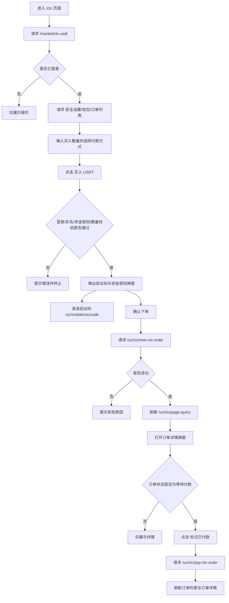
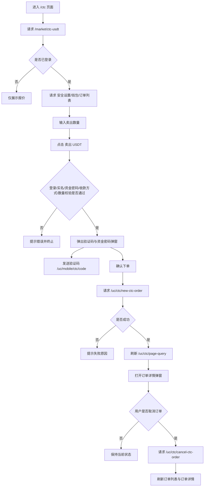
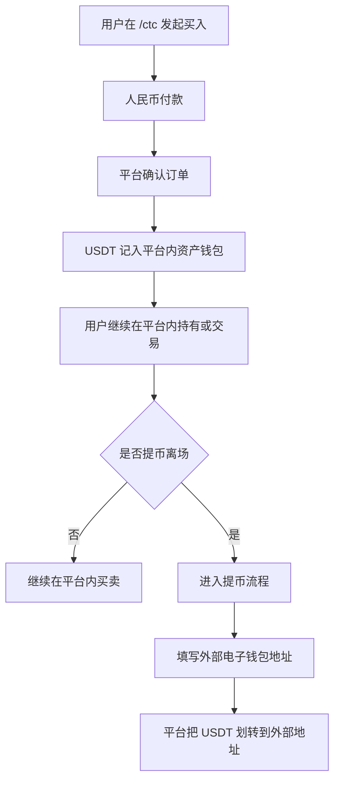
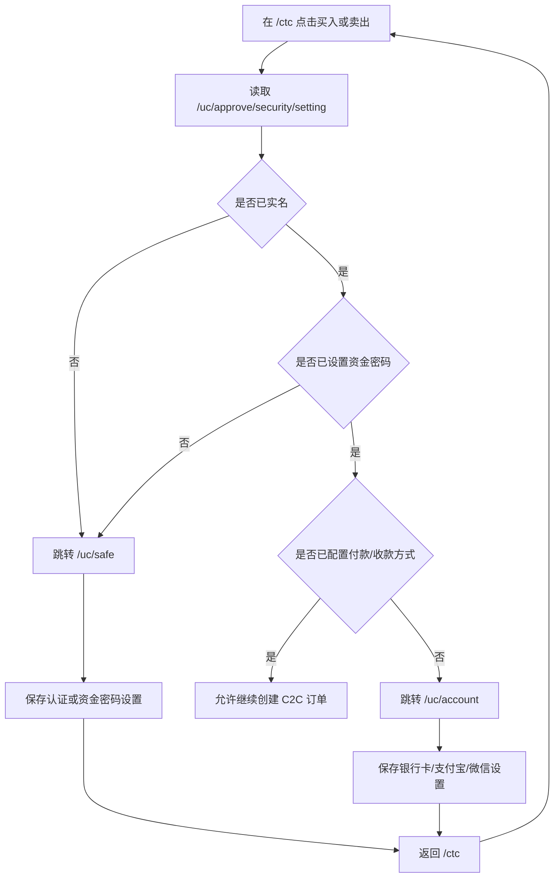

# C2C 快捷买卖流程梳理

## 买币

### 用户操作步骤

1. 用户进入 `/ctc` 页面，默认看到 `USDT交易` 页签。
2. 在左侧买币面板查看平台买入报价，输入买入数量，选择付款方式。
3. 点击“买入 USDT”按钮。
4. 如果未登录、未实名认证、未设置资金密码，页面会先给出提示并阻止继续下单。
5. 校验通过后，页面弹出短信验证码和资金密码确认弹窗。
6. 用户发送验证码，填写短信验证码和资金密码后确认下单。
7. 下单成功后，页面刷新订单列表，并自动打开订单详情弹窗。
8. 用户在订单详情中查看付款信息；若订单状态为“已接单，等待付款”，可点击“标记已付款”。

### 业务逻辑说明

1. 页面初始化时先请求 `/market/ctc-usdt` 获取 C2C 买卖报价，并把买价展示到买币面板。
2. 若用户已登录，页面同时请求：
   - `/uc/approve/security/setting` 获取实名认证、资金密码、收款方式状态；
   - `/uc/asset/wallet/USDT` 获取平台内 USDT 钱包余额；
   - `/uc/ctc/page-query` 获取当前 C2C 订单列表。
3. 点击买入时，前端先做四类校验：
   - 是否已登录；
   - 是否已完成实名认证；
   - 是否已设置资金密码；
   - 买入数量是否在 `50 ~ 50000 USDT` 之间。
4. 前端会把安全设置接口返回的 `true / false / 1 / 0` 统一归一化为布尔值后再做校验，避免旧逻辑误判。
5. 用户确认验证码和资金密码后，前端构造买单参数并请求 `/uc/ctc/new-ctc-order`：
   - `price` 取当前买价；
   - `amount` 取买入数量；
   - `payType` 取付款方式；
   - `direction = 0`；
   - `unit = USDT`；
   - 同时带上短信验证码和资金密码。
6. 下单成功后，页面重新请求 `/uc/ctc/page-query` 刷新订单列表，并将返回的订单详情展示在弹窗中。
7. 订单详情弹窗展示的是银行卡、支付宝、微信等收款信息。当前代码没有接入站内银行卡或第三方支付网关，用户需要在线下按这些信息手动转账。
8. 用户在详情弹窗点击“标记已付款”时，请求 `/uc/ctc/pay-ctc-order`；这一步只是把订单状态推进为“已付款”，不是实际发起人民币扣款。
9. 这套 `/ctc` 交易不是链上直充直提模型，而是平台托管账户模型。用户买入的 USDT 会记入平台内的 `USDT` 资产钱包，不需要在买入时提供外部链上地址。

### 流程图

## 卖币

### 用户操作步骤

1. 用户进入 `/ctc` 页面，在右侧卖币面板查看平台卖出报价。
2. 输入卖出数量，确认收款方式。
3. 页面会展示当前平台内 USDT 钱包可卖余额，便于用户判断是否可卖。
4. 点击“卖出 USDT”按钮。
5. 如果未登录、未实名认证、未设置资金密码、未配置收款方式，页面会提示并阻止继续下单。
6. 校验通过后，页面弹出短信验证码和资金密码确认弹窗。
7. 用户填写验证码和资金密码并确认下单。
8. 下单成功后，页面刷新订单列表，并打开订单详情弹窗查看收款信息与订单状态。
9. 若后续订单允许取消，用户可在详情弹窗点击“取消订单”。

### 业务逻辑说明

1. 页面初始化时同样通过 `/market/ctc-usdt` 获取卖出报价，并把卖价展示到卖币面板。
2. 登录后通过 `/uc/asset/wallet/USDT` 获取钱包余额，并显示在卖币面板的“可卖数量”位置。
3. 点击卖出时，前端先校验：
   - 是否已登录；
   - 是否已实名认证；
   - 是否已设置资金密码；
   - 是否已完成收款方式设置；
   - 卖出数量是否在 `2 ~ 50000 USDT` 之间。
4. 当前卖币收款方式界面展示的是平台内收款账户，卖出消耗的是平台内 `USDT` 钱包余额，不要求输入外部链上钱包地址。
5. 用户确认验证码和资金密码后，前端构造卖单参数并请求 `/uc/ctc/new-ctc-order`：
   - `price` 取当前卖价；
   - `amount` 取卖出数量；
   - `payType` 取收款方式；
   - `direction = 1`；
   - `unit = USDT`；
   - 同时带上短信验证码和资金密码。
6. 下单成功后，页面刷新 `/uc/ctc/page-query`，并弹出详情窗口展示对手方或平台的收付款信息。
7. 当前卖出流程也没有接入站内自动打款能力。前端只展示收款账户和订单状态，实际人民币付款由平台或对手方在线下按收款方式完成。
8. 用户点击“取消订单”时，请求 `/uc/ctc/cancel-ctc-order`，成功后刷新列表并同步更新详情状态。

### 流程图

## 平台托管账户模型说明

### 用户操作步骤

1. 用户在 `/ctc` 页面买入 USDT，只需要填写买入数量和法币付款方式。
2. 用户在 `/ctc` 页面卖出 USDT，只需要填写卖出数量和法币收款方式。
3. 用户只有在后续“提币/提现离场”场景，才需要提供外部电子钱包地址。

### 业务逻辑说明

1. 当前 `/ctc` 页面是中心化托管账户模型，不是链上点对点直接交割模型。
2. 买入时，用户支付的是人民币；平台确认订单后，把 USDT 记入平台内部的 `USDT` 钱包余额。
3. 买入时，用户并不是在站内直接完成银行卡或支付宝扣款，而是根据订单详情中的收款信息在线下手动转账；完成后再回平台点击“我已线下付款”。
4. 卖出时，平台从用户平台内部的 `USDT` 钱包余额中扣减相应数量，再按收款方式给用户支付人民币；这一步也不是前端站内自动打款，而是平台或对手方在线下完成付款。
5. 因为资产先记在平台内部账户中，所以买入和卖出阶段都不需要用户填写外部链上钱包地址。
6. 这也是 `/ctc` 页面会依赖实名认证、资金密码、银行卡/支付宝/微信收款设置的原因：这些配置服务的是平台内账户和法币结算，不是链上地址管理。

### 流程图

## `/ctc` 买卖前置条件说明

### 用户操作步骤

1. 用户在 `/ctc` 页面点击“买入 USDT”或“卖出 USDT”。
2. 若系统提示需要先完成实名认证、资金密码或付款/收款设置，用户可以跳转到 `/uc/safe` 或 `/uc/account`。
3. 用户完成设置后，再返回 `/ctc` 继续买卖。

### 业务逻辑说明

1. `/ctc` 页面下单前依赖两类前置状态：
   - `/uc/safe` 提供的实名认证、资金密码状态；
   - `/uc/account` 提供的付款/收款方式状态。
2. 当前代码里，`/ctc` 自身主要读取 `/uc/approve/security/setting` 来判断：
   - `realVerified` 是否已实名认证；
   - `fundsVerified` 是否已设置资金密码；
   - `accountVerified` 是否已完成收款方式设置。
3. `/uc/account` 页面负责绑定银行卡、支付宝、微信等法币收款方式；这部分配置主要影响卖出链路。
4. `/uc/safe` 页面负责实名认证、手机、登录密码、资金密码等设置；这部分配置会影响买入和卖出链路。
5. 在当前仓库里，这两块页面依赖的很多“保存”接口仍是旧链路，开发环境下不能单靠现有真实后端完整跑通，因此需要本地开发 mock 提供“已完成设置”的状态和保存回写能力。

### 流程图

