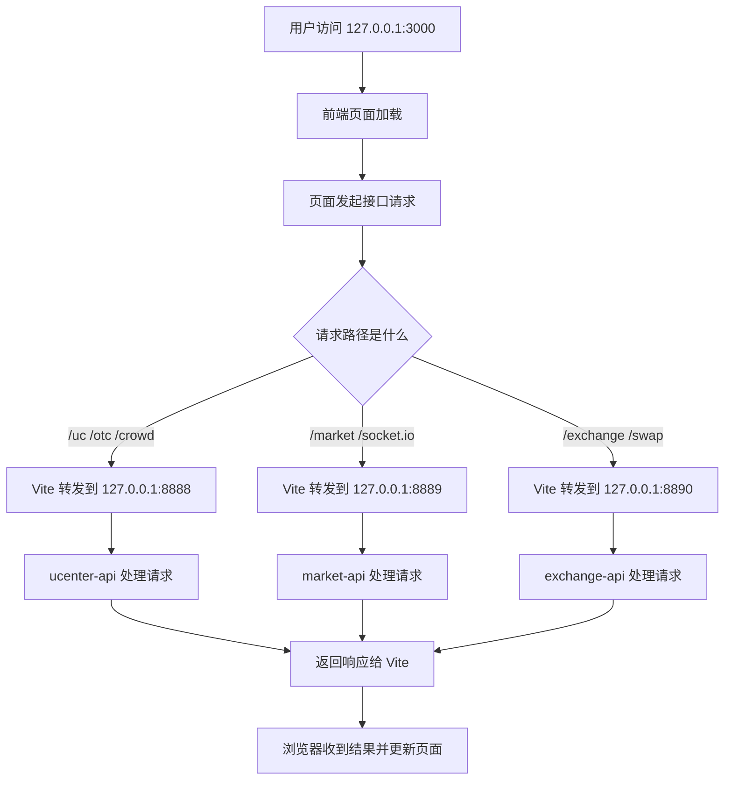
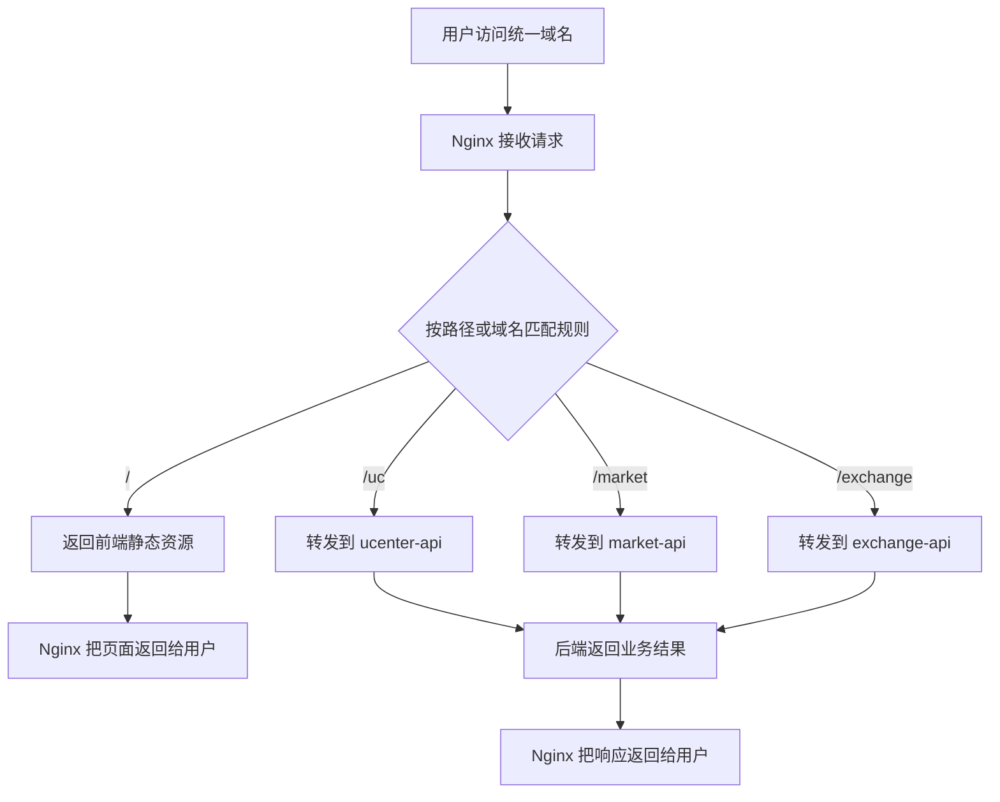
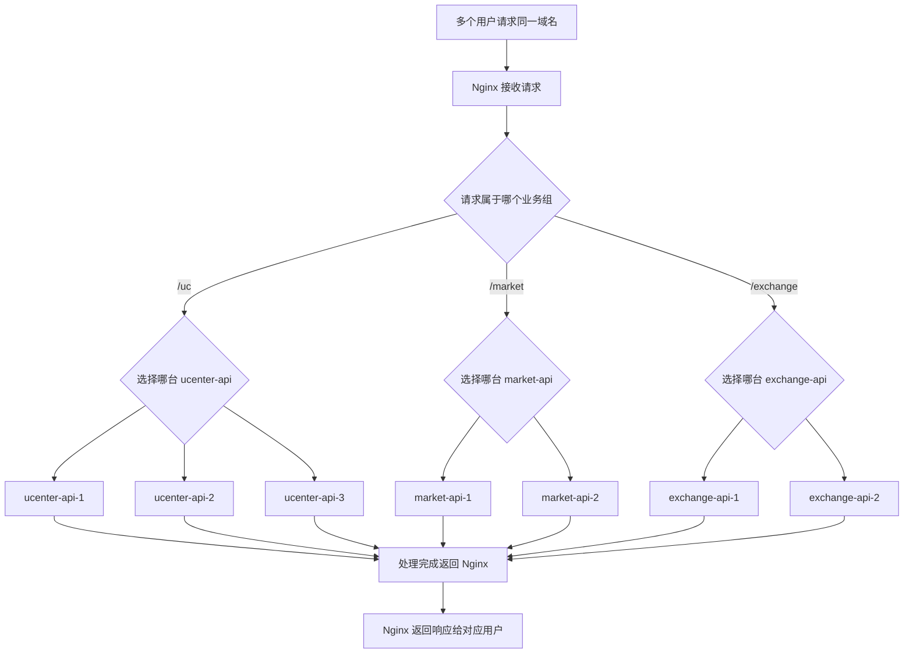

# Nginx业务流程梳理

说明：当前仓库没有独立的 `nginx.conf` 或 Nginx 容器配置。开发环境里，实际承担同类职责的是 `mscoin-frontend/vite.config.mjs` 中的 `server.proxy`。本文第一章按当前代码真实实现梳理；第二、三章是 Nginx 概念对照，用来解释反向代理和负载均衡，不代表仓库当前已经落地这些配置。

## 一、开发环境中的代理转发流程（当前仓库实际实现）

### 1. 用户操作步骤

1. 用户访问前端地址 `http://127.0.0.1:3000`。
2. 用户在页面中浏览首页、登录页、个人中心等前端页面。
3. 页面在需要数据时发起接口请求，例如 `/uc/login`、`/market/symbol-thumb`、`/exchange/order/current`。
4. 浏览器仍然把这些请求发给 `3000` 端口。
5. 前端开发服务器根据请求路径，把请求分别转发到不同后端服务。
6. 后端服务返回结果后，前端页面继续渲染或跳转。

### 2. 业务逻辑说明

当前仓库里没有独立 Nginx，开发期入口是 `mscoin-frontend/vite.config.mjs`。Vite 在 `3000` 端口启动后，一方面返回前端页面和静态资源，另一方面按路径充当反向代理。

代码里的真实转发关系如下：

- `/uc`、`/otc`、`/crowd` 转发到 `http://127.0.0.1:8888`
- `/market`、`/socket.io` 转发到 `http://127.0.0.1:8889`
- `/exchange`、`/swap` 转发到 `http://127.0.0.1:8890`

对应后端服务配置分别在：

- `mscoin-backend/ucenter-api/etc/conf.yaml`
- `mscoin-backend/market-api/etc/conf.yaml`
- `mscoin-backend/exchange-api/etc/conf.yaml`

这条链路的核心含义是：浏览器表面上只访问一个入口 `3000`，但真正处理请求的是后面的多个 API 服务。前端开发服务器把请求代为转发给后端，再把响应带回来。从请求方向看，这已经是“反向代理”的工作方式，只是当前实现者不是 Nginx，而是 Vite。

### 3. 流程图

## 二、Nginx反向代理流程（概念对照，当前仓库未单独落地）

### 1. 用户操作步骤

1. 用户访问统一域名，例如 `https://www.example.com`。
2. 用户点击页面按钮或提交表单，请求仍然发送到这个统一域名。
3. Nginx 先接收所有请求。
4. Nginx 根据路径、域名、协议或其他规则，把请求转发到后面的真实服务。
5. 真实服务处理完成后，把结果返回给 Nginx。
6. Nginx 再把结果返回给用户。

### 2. 业务逻辑说明

Nginx 是一个高性能 Web 服务器和流量转发器。它最常见的职责有三个：提供静态文件、做反向代理、做负载均衡。

所谓反向代理，就是代理“服务端”。用户看到的入口只有 Nginx，不直接看到后面真实的应用服务、端口和机器。请求路径是“用户 -> Nginx -> 后端服务 -> Nginx -> 用户”。

它之所以叫“反向”，是因为它和“正向代理”方向相反：

- 正向代理是替客户端去访问外部服务。
- 反向代理是替服务端接收客户端请求。

如果把它代入本项目，未来若使用 Nginx，最典型的职责就是：

- `/` 返回前端打包后的静态文件
- `/uc` 转发到 `ucenter-api`
- `/market` 转发到 `market-api`
- `/exchange` 转发到 `exchange-api`

这样浏览器只需要记住一个域名，不需要知道 `8888`、`8889`、`8890` 这些内部端口。

### 3. 流程图

## 三、Nginx负载均衡流程（概念对照，当前仓库未单独落地）

### 1. 用户操作步骤

1. 多个用户同时访问同一个域名。
2. 所有请求先到 Nginx。
3. Nginx 不再只把请求转发给一台后端，而是在同一业务服务的多台机器之间做分配。
4. 某一台后端处理完成后，把结果通过 Nginx 返回给对应用户。
5. 后续新的请求继续由 Nginx 按规则分发到其他可用后端。

### 2. 业务逻辑说明

负载均衡的前提是：同一个业务能力后面不止一台服务实例。比如后面有三台 `ucenter-api`，都能处理 `/uc/login`。

Nginx 能做负载均衡，是因为它可以维护一组后端服务列表，并在每次收到请求时，按调度规则挑选一个目标服务。常见规则有：

- 轮询：一个一个轮着分
- 权重分配：性能好的机器分更多请求
- 最少连接：优先给当前压力更小的机器
- IP 哈希：尽量让同一来源请求落到固定机器

所以“负载均衡”不是和“反向代理”并列的另一种完全不同能力，而通常是反向代理再往前走一步：Nginx 先站在服务前面接请求，再决定把请求转给哪一台后端。

如果代入本项目的未来生产形态，可以理解为：

- 浏览器仍然只访问一个统一域名
- Nginx 先按路径判断这是 `/uc`、`/market` 还是 `/exchange`
- 再在对应业务组的多台后端实例里选一台去处理

### 3. 流程图

