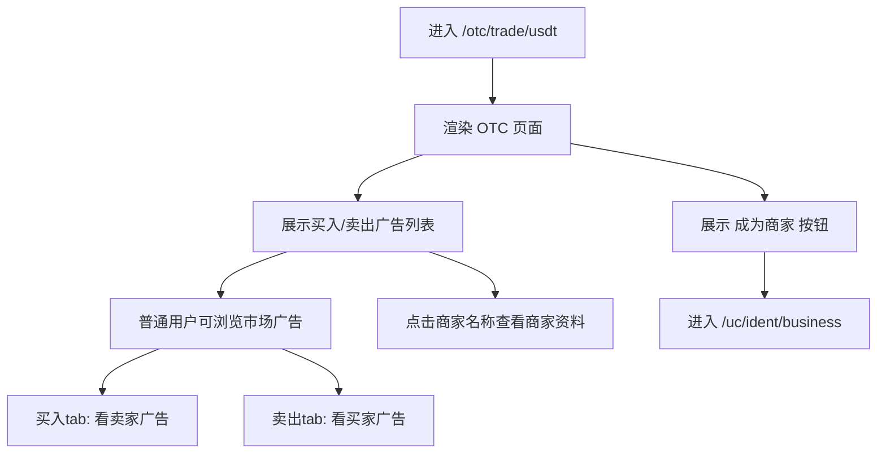
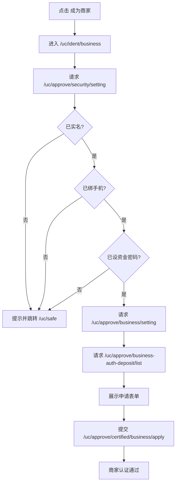
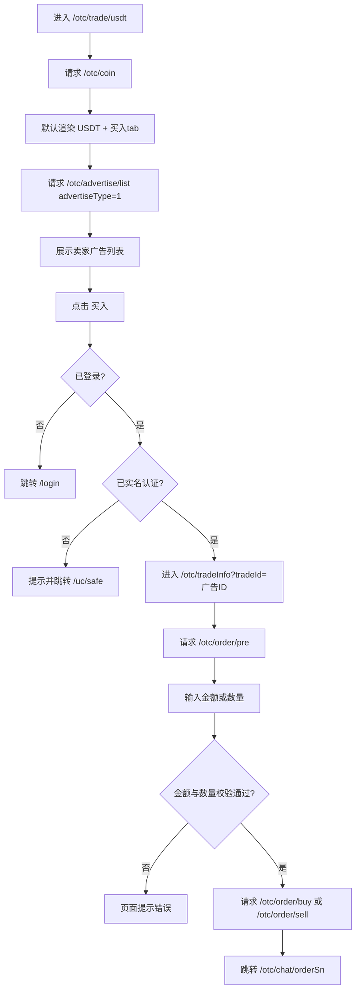
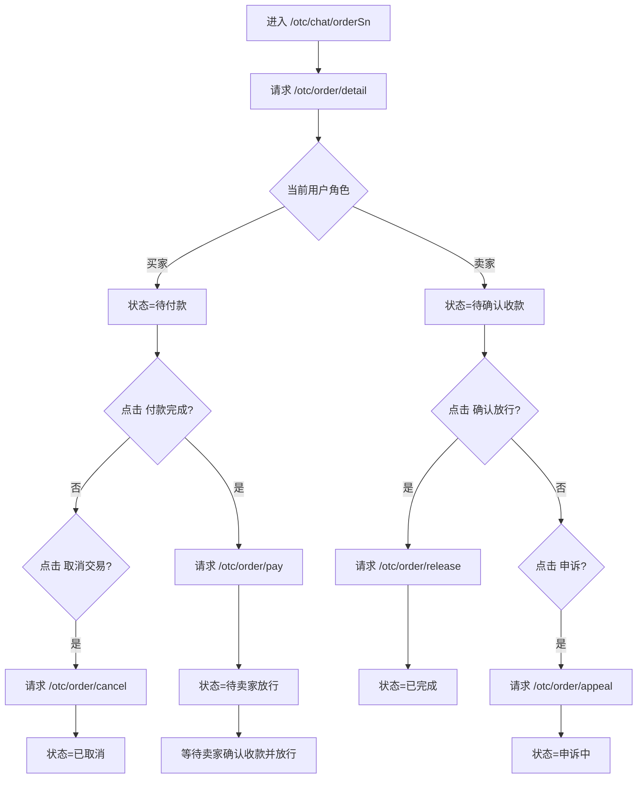
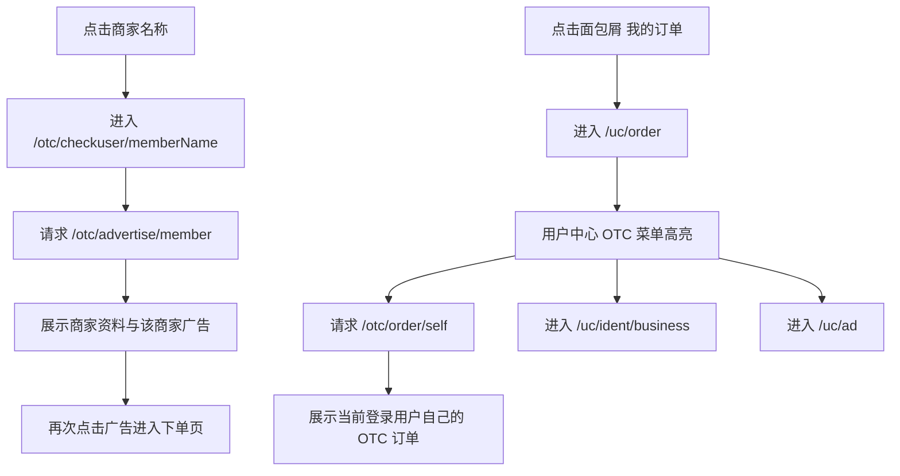

# OTC业务流程梳理

说明：当前仓库前端 OTC 主链路位于 `mscoin-frontend/src/pages-vue3/otc/`，活动入口为 `mscoin-frontend/src/main-vue3.js`。本地联调时，OTC 相关接口主要由 `mscoin-frontend/dev/localAcceptanceMocks.mjs` 提供验收数据。

## OTC入口与角色识别

### 用户操作步骤

1. 用户访问 `http://127.0.0.1:3000/#/otc/trade/usdt` 进入 OTC 页面。
2. 页面顶部显示 OTC 头图区、成为商家按钮、币种标签和买入/卖出两个 tab。
3. 用户不需要先成为商家，也可以直接浏览买入/卖出广告列表。
4. 用户点击列表里的商家名称，可以查看该商家的公开资料和该商家名下广告。

### 业务逻辑说明

1. OTC 页面是场外广告市场页面，不是“商家后台入口”。
2. 当前登录用户进入 OTC 页面时，默认身份仍然是普通用户，页面展示的是市场上其他用户发布的广告。
3. 买入 tab 显示的是“卖家广告”，也就是别人卖 USDT，你向他买。
4. 卖出 tab 显示的是“买家广告”，也就是别人收 USDT，你把自己的 USDT 卖给他。
5. “成为商家”按钮跳转到 `/uc/ident/business`，这是单独的商家认证流程；是否能看见 OTC 列表、是否能下单，与是否已经成为商家不是同一个判断。
6. 当前本地 mock 中，`merchant-alpha`、`merchant-beta` 是验收用商家样例名称，所以在列表、详情页、订单页里看到这些名称，表示订单对手方来自对应广告发布者。

### 流程图

## 商家认证流程

### 用户操作步骤

1. 用户在 OTC 页面点击“成为商家”按钮。
2. 页面跳转到 `/uc/ident/business`。
3. 如果用户未完成实名认证、未绑定手机号或未设置资金密码，页面提示后跳转到 `/uc/safe`。
4. 如果前置条件都满足，页面显示商家认证说明、保证金币种与申请入口。
5. 用户勾选协议、填写申请资料、上传材料后提交商家认证申请。
6. 认证通过后，用户可以进入我的广告页并发布广告。

### 业务逻辑说明

1. `Main.vue` 中“成为商家”按钮只负责跳转到 `/uc/ident/business`。
2. `IdentBusiness.vue` 进入后先请求 `/uc/approve/security/setting`，校验三个前置条件：
   - 是否已实名认证
   - 是否已绑定手机号
   - 是否已设置资金密码
3. 任一条件不满足时，前端弹提示并跳转 `/uc/safe`。
4. 条件满足后，再请求：
   - `/uc/approve/business/setting` 获取商家认证状态
   - `/uc/approve/business-auth-deposit/list` 获取商家保证金配置
5. 用户提交申请时调用 `/uc/approve/certified/business/apply`。
6. 商家认证通过，表示当前账号获得“发布 OTC 广告”的资格；它不影响普通买卖入口是否可见。

### 流程图

## 广告列表与下单流程

### 用户操作步骤

1. 用户进入 OTC 页面后，默认看到 `USDT` 币种与买入 tab。
2. 用户在买入 tab 查看卖家广告列表，列表字段包含商家、交易笔数、支付方式、数量、限额、价格等。
3. 用户点击某条广告上的“买入”按钮，进入 `/otc/tradeInfo?tradeId=<advertiseId>`。
4. 页面展示对手方信息、广告价格、限额、支付方式、交易须知。
5. 用户输入法币金额，例如 `100 CNY`，页面自动反算可买到多少 `USDT`。
6. 用户点击确认买入，创建订单后跳转到 `/otc/chat/<orderSn>`。

### 业务逻辑说明

1. `Main.vue` 先请求 `/otc/coin` 获取 OTC 币种列表。
2. `Trade.vue` 根据当前 tab 请求 `/otc/advertise/list`：
   - `advertiseType=1` 时返回卖家广告，渲染买入 tab
   - `advertiseType=0` 时返回买家广告，渲染卖出 tab
3. 当前代码里，普通登录用户只要已完成实名认证，就可以点广告进入下单页；不要求先成为商家。
4. 点击广告后进入 `TradeInfo.vue`，先请求 `/otc/order/pre` 读取广告详情。
5. 用户输入金额或数量时，前端按价格做双向换算，并校验：
   - 金额必须落在 `minLimit ~ maxLimit`
   - 数量必须大于 0 且不能超过广告可成交数量
6. 广告类型决定下单接口：
   - 卖家广告下单调用 `/otc/order/buy`
   - 买家广告下单调用 `/otc/order/sell`
7. 下单成功后，接口返回订单号 `orderSn`，前端跳转 `/otc/chat/<orderSn>`。

### 流程图

## 订单详情与后续状态流程

### 用户操作步骤

1. 用户下单成功后进入 `/otc/chat/<orderSn>`。
2. 页面展示面包屑“我的订单 > 订单详情”、对手方昵称、订单号、单价、数量、总金额、收款方式与聊天区域。
3. 如果当前用户是买家，初始状态为“待付款”，可执行“付款完成”或“取消交易”。
4. 买家点击“付款完成”后，订单状态变为“待卖家放行”。
5. 此时买家侧主流程结束，后续需要等待卖家确认收款并放行，或者由买家在超时后发起申诉。
6. 如果当前用户是卖家，则在收到付款通知后进入“待确认收款”，可执行“确认放行”或“申诉”。
7. 卖家放行后，订单变为“已完成”。

### 业务逻辑说明

1. `Chat.vue` 进入后请求 `/otc/order/detail` 拉取订单详情。
2. 当前状态机按代码实现为：
   - `1`：待付款
   - `2`：买家已付款，等待卖家处理
     - 买家视角文案：待卖家放行
     - 卖家视角文案：待确认收款
   - `3`：已完成
   - `0`：已取消
   - `4`：申诉中
3. 买家点击“付款完成”时调用 `/otc/order/pay`，状态更新为 `2`。
4. 卖家点击“确认放行”时调用 `/otc/order/release`，状态更新为 `3`。
5. 任一方点击“取消交易”时调用 `/otc/order/cancel`，状态更新为 `0`。
6. 任一方点击“申诉”时调用 `/otc/order/appeal`，状态更新为 `4`。
7. 所以你在买家侧点击“付款完成”后看到“待放行”，表示当前应该由卖家继续操作，这正是当前代码表达的业务含义。

### 流程图

## 商家详情、我的订单与我的广告

### 用户操作步骤

1. 用户在 OTC 列表或订单详情页点击商家名称，进入 `/otc/checkuser/<memberName>`。
2. 页面展示该商家的认证状态、交易笔数以及该商家名下的买卖广告。
3. 用户在订单详情页点击面包屑“我的订单”，进入 `/uc/order`。
4. 用户进入用户中心后，可在 OTC 菜单下看到：
   - 商家认证
   - 我的广告
   - 我的订单
5. 已通过商家认证的用户，可以在 `/uc/ad` 与 `/uc/ad/create` 管理和发布自己的 OTC 广告。

### 业务逻辑说明

1. `CheckUser.vue` 通过 `/otc/advertise/member` 查询指定商家的资料与广告。
2. 商家详情页里的买卖列表仍然是该商家发布的广告，不是当前登录用户的广告。
3. `myorder.vue` 通过 `/otc/order/self` 查询当前登录用户自己的 OTC 订单。
4. `MemberCenter.vue` 现已恢复 OTC 菜单分组，`/uc/order` 不再落到活动中心语义下。
5. “我的广告”是商家视角能力；“我的订单”是普通买家和卖家都会用到的订单列表能力。

### 流程图

