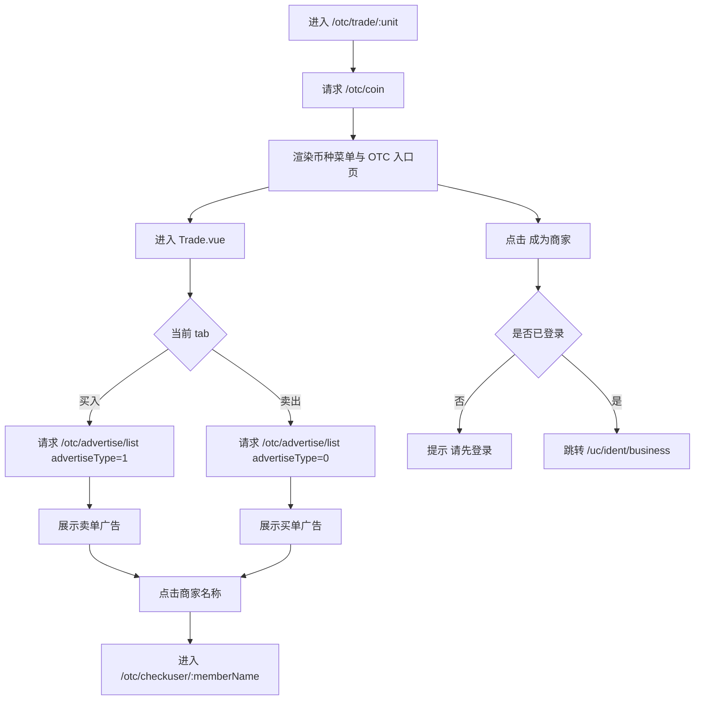
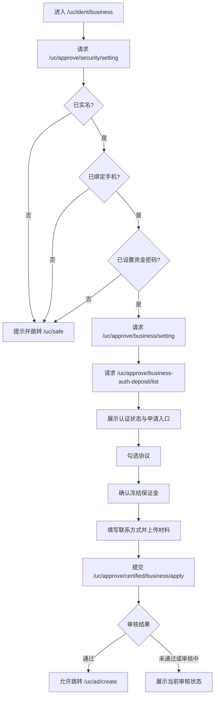
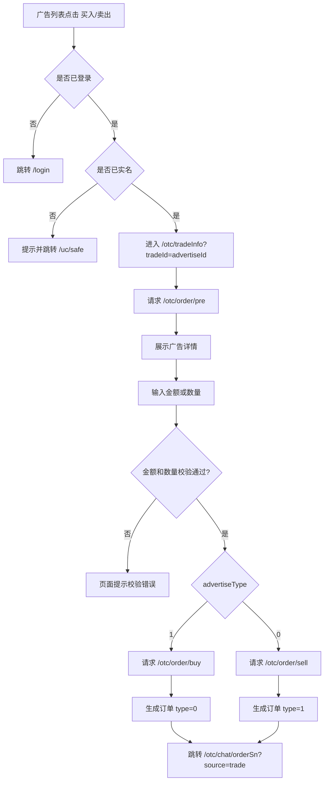
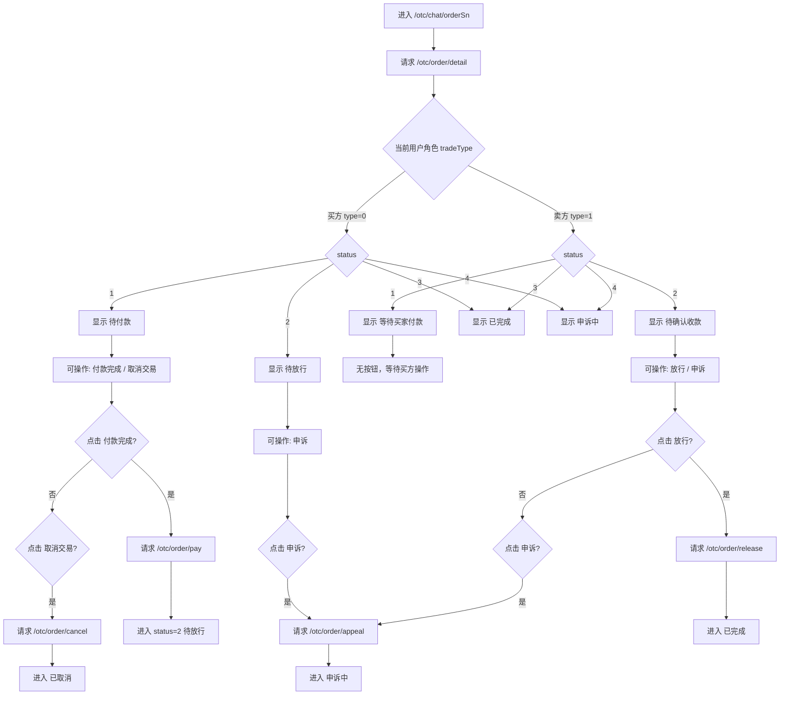
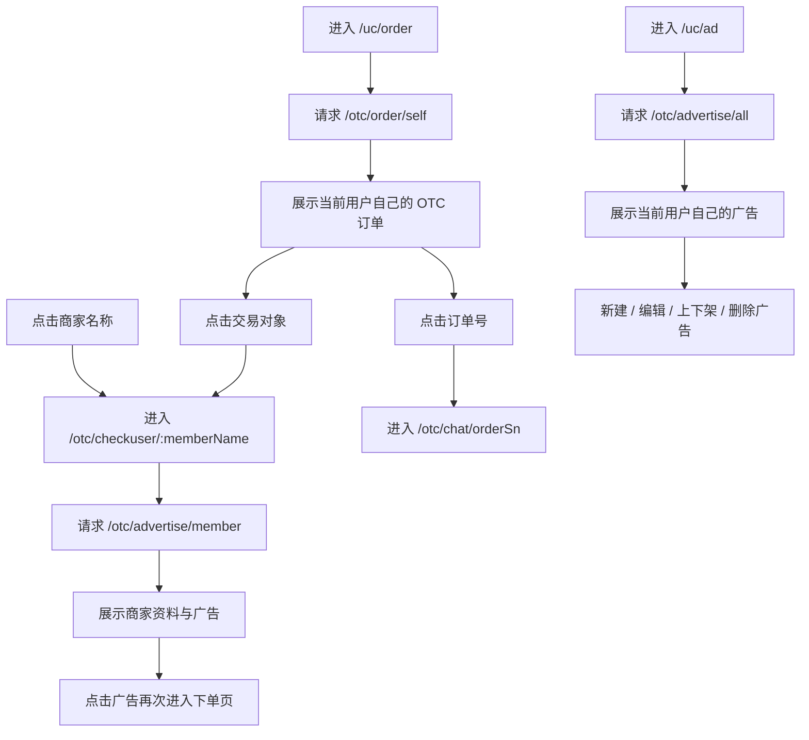

# OTC业务流程梳理

说明：本文以当前仓库中的 Vue 3 OTC 页面主链路和本地联调数据为准，核心代码位于 `mscoin-frontend/src/pages-vue3/otc/`、`mscoin-frontend/src/pages-vue3/uc/` 与 `mscoin-frontend/dev/localAcceptanceMocks.mjs`。当前本地开发环境下，OTC 相关接口主要由本地 mock 提供验收数据。

## OTC入口与广告市场

### 用户操作步骤

1. 用户访问 `/#/otc/trade/:unit` 进入 OTC 页面，默认按币种展示广告市场。
2. 页面顶部展示 OTC 头图区、币种切换菜单和“买入 / 卖出”两个交易 tab。
3. 用户可以直接浏览广告列表，不需要先成为商家。
4. 用户点击“成为商家”按钮后，已登录用户跳转到 `/uc/ident/business`，未登录用户只收到“请先登录”提示。
5. 用户点击广告列表中的商家名称，可以进入商家详情页查看该商家的公开资料和广告。

### 业务逻辑说明

1. OTC 入口页为 [Main.vue](/E:/Project/web3/mscoin/mscoin-frontend/src/pages-vue3/otc/Main.vue)，进入后先请求 `/otc/coin` 获取可交易币种。
2. 币种菜单切换时，前端通过路由 `/otc/trade/:unit` 驱动子页面刷新，不在当前页内直接切换列表数据。
3. “成为商家”按钮只负责跳转 `/uc/ident/business`，不会影响普通用户浏览 OTC 广告市场。
4. OTC 列表页为 [Trade.vue](/E:/Project/web3/mscoin/mscoin-frontend/src/pages-vue3/otc/Trade.vue)，页面不是“当前账号买家/卖家身份切换页”，而是广告市场页。
5. `buy` tab 请求 `/otc/advertise/list` 且 `advertiseType=1`，展示卖单广告，表示“别人卖币，你来买”。
6. `sell` tab 请求 `/otc/advertise/list` 且 `advertiseType=0`，展示买单广告，表示“别人买币，你来卖”。
7. 列表按钮文案按“当前登录用户要执行的动作”显示，而不是按广告发布者身份显示：
8. 广告 `advertiseType=1` 时，列表按钮显示“买入”。
9. 广告 `advertiseType=0` 时，列表按钮显示“卖出”。

### 流程图

## 商家认证与广告发布

### 用户操作步骤

1. 用户在 OTC 页面或用户中心点击“成为商家 / 商家认证”进入 `/uc/ident/business`。
2. 页面先校验实名、手机号、资金密码三项基础安全设置。
3. 如果任一条件不满足，页面提示后跳转 `/uc/safe`。
4. 条件满足后，页面展示商家认证状态、保证金币种要求和申请入口。
5. 用户勾选协议，进入二次确认弹窗，确认冻结保证金要求后填写手机号、微信号、QQ 号并上传材料。
6. 用户提交申请后进入审核流程。
7. 审核通过后，用户可以进入 `/uc/ad/create` 发布 OTC 广告，也可以进入 `/uc/ad` 管理已有广告。

### 业务逻辑说明

1. 商家认证页为 [IdentBusiness.vue](/E:/Project/web3/mscoin/mscoin-frontend/src/pages-vue3/uc/IdentBusiness.vue)。
2. 页面进入后先请求 `/uc/approve/security/setting`，校验：
3. 是否已实名。
4. 是否已绑定手机。
5. 是否已设置资金密码。
6. 三项校验任一不满足时，前端直接提示并跳转 `/uc/safe`，不会继续展示申请表单。
7. 校验通过后，请求 `/uc/approve/business/setting` 读取当前商家认证状态。
8. 同时请求 `/uc/approve/business-auth-deposit/list` 获取保证金币种和数量配置。
9. 用户提交资料时，请求 `/uc/approve/certified/business/apply`，提交参数包含保证金配置 ID 和表单 JSON。
10. 审核通过后，页面开放“发布广告”入口，跳转 `/uc/ad/create`。
11. 我的广告页为 [MyAd.vue](/E:/Project/web3/mscoin/mscoin-frontend/src/pages-vue3/otc/MyAd.vue)，当前实现通过 `/otc/advertise/all` 查询自己的广告列表，并支持：
12. 跳转 `/uc/ad/create` 新建广告。
13. 跳转 `/uc/ad/update?id=<id>` 编辑上架中的广告。
14. 调 `/otc/advertise/on/shelves` 或 `/otc/advertise/off/shelves` 上下架广告。
15. 仅允许删除已下架广告，删除接口为 `/otc/advertise/delete`。

### 流程图

## OTC下单流程

### 用户操作步骤

1. 用户在 OTC 广告列表中选择一条广告。
2. 用户点击广告上的“买入”或“卖出”按钮进入 `/otc/tradeInfo?tradeId=<advertiseId>`。
3. 如果用户未登录，页面跳转 `/login`。
4. 如果用户已登录但未实名，页面提示后跳转 `/uc/safe`。
5. 用户进入下单页后查看商家信息、单价、限额、剩余数量、收款方式和交易须知。
6. 用户输入法币金额或数字货币数量，页面自动换算另一侧数值。
7. 用户点击确认按钮提交订单。
8. 下单成功后跳转 `/otc/chat/<orderSn>?source=trade` 进入订单详情与聊天页。

### 业务逻辑说明

1. 广告列表点击事件在 [Trade.vue](/E:/Project/web3/mscoin/mscoin-frontend/src/pages-vue3/otc/Trade.vue) 中统一处理。
2. 点击广告前，前端先校验登录状态和实名状态，不校验“是否商家”。
3. 下单详情页为 [TradeInfo.vue](/E:/Project/web3/mscoin/mscoin-frontend/src/pages-vue3/otc/TradeInfo.vue)，进入后先请求 `/otc/order/pre` 获取广告详情和页面展示数据。
4. 下单页输入金额和数量时，会按广告价格做双向换算。
5. 提交前前端校验：
6. 金额必须落在广告 `minLimit ~ maxLimit` 之间。
7. 数量必须大于 0，且不能超过广告可交易数量。
8. 下单接口由广告类型决定，映射逻辑在 [trade-info.js](/E:/Project/web3/mscoin/mscoin-frontend/src/pages-vue3/otc/trade-info.js)：
9. `advertiseType=1` 调 `/otc/order/buy`，表示当前用户对卖单广告下单，当前用户在该订单里是买方。
10. `advertiseType=0` 调 `/otc/order/sell`，表示当前用户对买单广告下单，当前用户在该订单里是卖方。
11. 本地 mock 在 `createOtcOrder` 中将 `/otc/order/buy` 创建的订单记为 `type=0`，将 `/otc/order/sell` 创建的订单记为 `type=1`。
12. 这里的 `type` 表示“当前登录用户在订单中的角色”：
13. `type=0` 表示当前用户是买方。
14. `type=1` 表示当前用户是卖方。

### 流程图

## OTC订单详情与状态流转

### 用户操作步骤

1. 用户下单成功后进入 `/otc/chat/<orderSn>`。
2. 页面顶部展示订单摘要条，包含订单号、对手方、金额、数量、单价、剩余时间和主状态。
3. 页面中部展示收款方式、聊天区和订单侧栏。
4. 如果当前用户是买方且订单处于待付款阶段，页面显示“付款完成”和“取消交易”按钮。
5. 买方可以点击支付宝或微信收款项查看二维码后线下付款，再点击“付款完成”。
6. 如果当前用户是卖方且订单仍处于买方待付款阶段，页面主状态显示“等待买家付款”，不显示可操作按钮。
7. 买方标记付款完成后，卖方进入“待确认收款”阶段，可以执行“放行”或“申诉”。
8. 买方在卖方未放行前，可以发起“申诉”。
9. 卖方放行后，订单完成。
10. 任一方进入申诉后，页面状态变为“申诉中”。

### 业务逻辑说明

1. 订单详情页为 [Chat.vue](/E:/Project/web3/mscoin/mscoin-frontend/src/pages-vue3/otc/Chat.vue)，页面进入后请求 `/otc/order/detail`。
2. 状态展示和按钮权限集中在 [chat-state.js](/E:/Project/web3/mscoin/mscoin-frontend/src/pages-vue3/otc/chat-state.js)。
3. 当前代码以 `status` 和 `tradeType` 共同决定主状态文案和操作按钮：
4. `tradeType=0` 表示当前用户是买方。
5. `tradeType=1` 表示当前用户是卖方。
6. `status=1` 时：
7. 买方显示“待付款”，按钮为“付款完成 / 取消交易”。
8. 卖方显示“等待买家付款”，不显示按钮。
9. `status=2` 时：
10. 买方显示“待放行”，按钮为“申诉”。
11. 卖方显示“待确认收款”，按钮为“放行 / 申诉”。
12. `status=3` 时显示“已完成”。
13. `status=4` 时显示“申诉中”。
14. 其他状态统一显示“已取消”。
15. 订单操作接口如下：
16. 买方点击“付款完成”调用 `/otc/order/pay`。
17. 买方点击“取消交易”调用 `/otc/order/cancel`。
18. 卖方点击“放行”调用 `/otc/order/release`。
19. 任一方点击“申诉”调用 `/otc/order/appeal`。
20. 页面倒计时按 `createTime + timeLimit` 计算，当前实现已兼容 ISO 时间和旧格式时间。
21. 自动取消只发生在“当前用户是买方且订单状态为待付款”这一阶段，即 `status=1 && tradeType=0`。
22. 本地 mock 中的支付宝和微信二维码字段已经返回到订单详情里，点击付款方式项可以查看二维码，但当前本地数据仍是占位图。

### 流程图

## 商家详情、我的订单与我的广告

### 用户操作步骤

1. 用户在 OTC 列表页或订单详情页点击商家名称，进入 `/otc/checkuser/:memberName`。
2. 页面展示商家基础资料、认证状态、注册时间、成交次数和该商家名下的买卖广告。
3. 用户点击商家详情页中的广告按钮，可以再次进入下单页。
4. 用户在用户中心进入“我的订单”页面，查看自己参与过的 OTC 订单。
5. 用户可以按“待付款、已付款、已完成、已取消、申诉中”筛选订单，也可以按订单号搜索。
6. 用户点击订单号进入订单详情页，点击交易对象进入商家详情页。
7. 已通过商家认证的用户进入“我的广告”页面，可以查看、上下架、编辑和删除自己的广告。

### 业务逻辑说明

1. 商家详情页为 [CheckUser.vue](/E:/Project/web3/mscoin/mscoin-frontend/src/pages-vue3/otc/CheckUser.vue)。
2. 页面进入后通过 `/otc/advertise/member` 按商家名称查询资料和广告，结果分为 `sell` 与 `buy` 两组。
3. 商家详情页里的“买入 / 卖出”按钮仍然复用普通 OTC 下单入口，逻辑与主列表页一致。
4. 我的订单页为 [myorder.vue](/E:/Project/web3/mscoin/mscoin-frontend/src/pages-vue3/uc/myorder.vue)。
5. 页面通过 `/otc/order/self` 查询当前登录用户自己的 OTC 订单。
6. 页面筛选状态直接把 tab 值作为 `status` 传给 `/otc/order/self`：
7. `1` 待付款。
8. `2` 已付款。
9. `3` 已完成。
10. `0` 已取消。
11. `4` 申诉中。
12. 订单列表中的 `type` 字段同样表示当前登录用户在该订单里的角色：
13. `0` 显示买入。
14. `1` 显示卖出。
15. 我的广告页通过 `/otc/advertise/all` 获取当前用户自己发布的广告，不展示其他商家的广告。
16. 用户中心 [MemberCenter.vue](/E:/Project/web3/mscoin/mscoin-frontend/src/pages-vue3/uc/MemberCenter.vue) 已恢复 OTC 菜单分组，入口包含“商家认证”“我的广告”“我的订单”。

### 流程图

