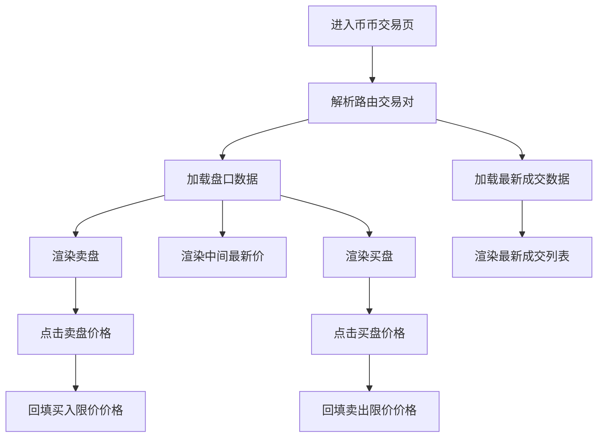
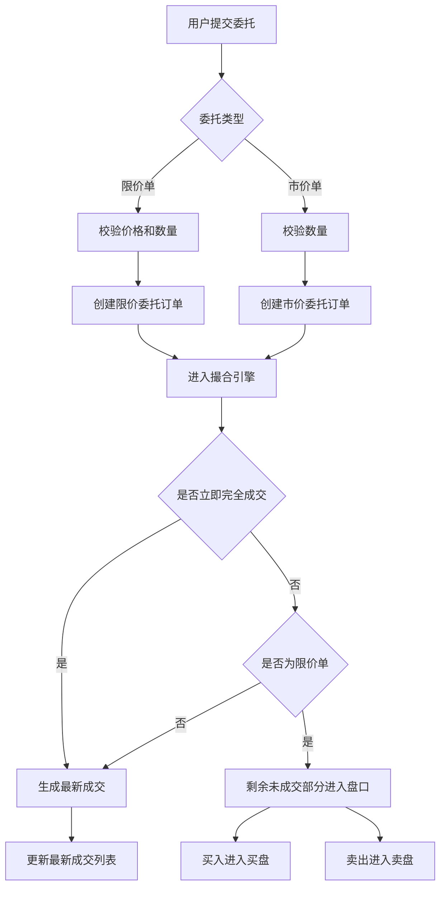
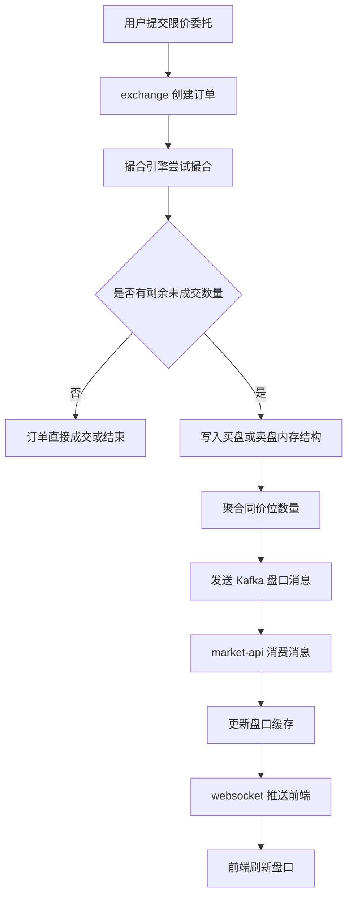

# 币币交易盘口业务梳理

## 概念说明

### 当前价格

- 当前价格指交易页盘口中间展示的“最新价”。
- 页面展示为“卖盘 / 最新价 / 买盘”三段结构，中间的最新价用于给上下盘口做锚定。
- 当前实现中，盘口中间价展示在 `mscoin-frontend/src/pages-vue3/exchange/Exchange.vue`。

### 最新成交

- 最新成交指最近几笔已经撮合完成的成交记录。
- 页面右下区域展示的是“数量 / 价格 / 时间”三列数据。
- 它用于反映最近真实成交发生了什么，不属于盘口本身，也不会直接进入买盘或卖盘。

### 买盘

- 买盘指当前市场中尚未成交的买入限价委托。
- 买盘中的每一行表示一个价格档位上的剩余买入数量。
- 离当前价格越近，说明越接近当前可成交区间。

### 卖盘

- 卖盘指当前市场中尚未成交的卖出限价委托。
- 卖盘中的每一行表示一个价格档位上的剩余卖出数量。
- 离当前价格越近，说明越接近当前可成交区间。

### 盘口

- 盘口是买盘和卖盘的合称。
- 本质上是当前未成交限价单的价格档位和数量汇总。
- 当前页面中，盘口由“卖盘表格 + 当前价格 + 买盘表格”组成。

### 委托订单

- 委托订单是用户提交给撮合系统的交易指令。
- 当前代码中，用户在交易区提交买入或卖出后，会创建一笔委托订单。
- 委托订单可能是限价单，也可能是市价单。

### 限价单

- 限价单是用户自己指定成交价格的委托。
- 系统只会按该价格或更优价格成交。
- 如果没有合适对手盘，订单会先挂着等待撮合。
- 未成交部分会进入盘口。

### 市价单

- 市价单是不指定成交价格、优先要求尽快成交的委托。
- 系统会直接按当前盘口最优对手价开始撮合。
- 市价单不会作为挂单长期停留在盘口中。

## 页面展示关系

### 用户操作步骤

1. 用户进入币币交易页，例如 `#/exchange/BTC_USDT`。
2. 页面根据路由解析出交易对，加载当前币种、盘口、最新成交和委托区域。
3. 用户可以查看右侧盘口中的卖盘、最新价、买盘。
4. 用户可以查看右下角“最新成交”，了解最近几笔成交记录。
5. 用户点击盘口某一行价格，可以把该价格带入限价委托输入框。
6. 用户在左侧选择“限价”或“市价”，填写数量后提交委托。

### 业务逻辑说明

1. 页面入口在 `mscoin-frontend/src/pages-vue3/exchange/Exchange.vue`，会把路由中的 `BTC_USDT` 转成 `BTC/USDT`，写入 `currentCoin.symbol`。
2. 盘口表格使用 `plate.askRows` 和 `plate.bidRows` 渲染。
3. 卖盘显示在当前价格上方，买盘显示在当前价格下方，中间单独展示“最新价”作为锚点。
4. 最新成交单独使用 `trade.rows` 渲染，显示最近成交的数量、价格和时间。
5. 点击卖盘价格行时，会把该价格回填到买入限价输入框。
6. 点击买盘价格行时，会把该价格回填到卖出限价输入框。
7. 盘口的作用是展示当前未成交限价单的挂单情况，并辅助用户快速填入限价价格。
8. 最新成交的作用是展示已经成交的结果，不参与盘口挂单展示。

### 流程图



## 盘口与最新成交的数据来源

### 用户操作步骤

1. 用户打开交易页后，无需额外操作，页面自动请求盘口和最新成交。
2. 页面保持打开时，会持续接收 websocket 推送，实时刷新盘口和最新成交。

### 业务逻辑说明

1. 盘口初始数据来自 `getPlate()`，请求 `api.market.platemini`，即后端 `market-api` 的 `/market/exchange-plate-mini`。
2. 前端收到盘口后，会分别构造卖盘 `plate.askRows` 和买盘 `plate.bidRows`。
3. 当前实现中，盘口固定展示 10 档，不足 10 档时以前端占位行 `--` 补齐。
4. 盘口中每一行还会计算累计数量 `totalAmount`。
5. 最新成交初始数据来自 `getTrade()`，请求 `api.market.trade`，写入 `trade.rows`。
6. 页面启动 websocket 后，会订阅：
   - `/topic/market/trade-plate/<symbol>`，用于刷新盘口
   - `/topic/market/trade/<symbol>`，用于刷新最新成交
7. websocket 的盘口推送是单边推送：
   - `direction = SELL` 只更新卖盘
   - `direction = BUY` 只更新买盘
8. 最新成交推送会把新成交插到 `trade.rows` 头部，并保留最近 30 条。
9. 盘口和最新成交都不是前端静态模拟数据，来自后端实时业务数据。

### 流程图

```mermaid
flowchart TD
    A[打开交易页] --> B[getPlate]
    A --> C[getTrade]
    B --> D[POST /market/exchange-plate-mini]
    C --> E[POST /market/latest-trade]
    D --> F[返回卖盘和买盘]
    E --> G[返回最新成交列表]
    F --> H[构造 askRows 和 bidRows]
    G --> I[写入 trade.rows]
    H --> J[渲染盘口]
    I --> K[渲染最新成交]
    A --> L[建立 websocket 订阅]
    L --> M[/topic/market/trade-plate/symbol]
    L --> N[/topic/market/trade/symbol]
    M --> O[刷新买盘或卖盘]
    N --> P[刷新最新成交]
```

## 委托订单、限价、市价与盘口关系

### 用户操作步骤

1. 用户在左侧交易区域选择“限价”或“市价”。
2. 如果是限价单，用户填写价格和数量。
3. 如果是市价单，用户只填写数量或金额。
4. 用户点击“买入”或“卖出”提交委托。
5. 系统创建委托订单并进入撮合流程。
6. 用户可在“当前委托”中查看未完成订单，在“委托历史”中查看历史订单。

### 业务逻辑说明

1. 限价买入调用 `buyWithLimitPrice()`，限价卖出调用 `sellLimitPrice()`。
2. 市价买入调用 `buyWithMarketPrice()`，市价卖出调用 `sellMarketPrice()`。
3. 前端在提交前会把 `price` 和 `amount` 统一转成数字后再发给后端。
4. 后端 `exchange-api` 接收请求后，转发给 `exchange` 服务的下单逻辑。
5. `exchange/internal/logic/order_logic.go` 会校验：
   - 价格是否合法
   - 数量是否合法
   - 币种是否存在
   - 钱包是否存在
   - 钱包余额是否足够
6. 如果是限价单：
   - 会先尝试撮合
   - 未完全成交的剩余部分会进入盘口
7. 如果是市价单：
   - 会直接吃当前盘口中的对手盘
   - 不会作为挂单长期停留在盘口中
8. 因此，盘口中的买盘和卖盘，本质上是未成交限价单的剩余挂单。
9. 最新成交是订单被撮合后的结果，不是挂单数据。

### 流程图



## 盘口的后端真实来源

### 用户操作步骤

1. 用户在前端看到盘口时，不需要手工触发后端动作。
2. 只要页面打开，后端撮合结果和盘口缓存变化会自动反映到页面。

### 业务逻辑说明

1. `market-api` 的 `ExchangePlateMini` 和 `ExchangePlateFull` 最终都会走 `loadTradePlate(symbol, size)`。
2. 该逻辑优先从内存缓存读取盘口，如果缓存没有，再从快照存储中恢复。
3. `exchange` 撮合服务维护真实的买盘和卖盘内存结构。
4. 限价单进入撮合后，如果有剩余未成交数量，会进入对应价格档位。
5. 相同价格的挂单会在盘口层聚合数量。
6. 撮合服务把盘口变化写入 Kafka topic `exchange_order_trade_plate`。
7. `market-api` 消费该消息后更新本地盘口缓存，再通过 websocket 推送给前端。
8. 所以当前盘口展示的不是外部交易所深度，而是本地撮合系统自己的盘口。

### 流程图



## 结论

- 当前价格是盘口中间的最新价，用于锚定卖盘和买盘的位置。
- 最新成交展示的是最近已经完成的成交记录，不属于盘口。
- 买盘和卖盘展示的是未成交限价单的剩余挂单。
- 限价单会先尝试撮合，未成交部分进入盘口。
- 市价单优先成交，不会作为挂单长期停留在盘口。
- 委托订单是用户下单动作产生的业务对象，成交后会影响最新成交，未成交限价部分会影响盘口。
- 当前页面盘口数据来自本地撮合系统，不是 OKX 深度。
