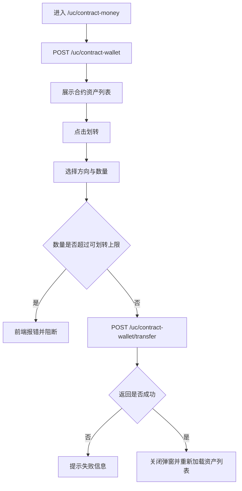
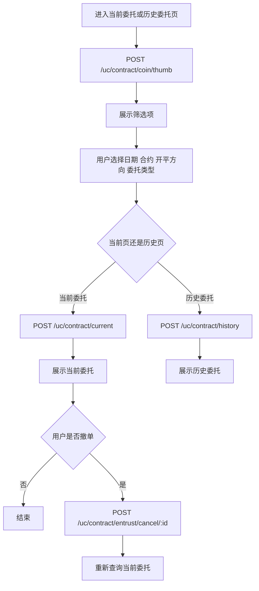
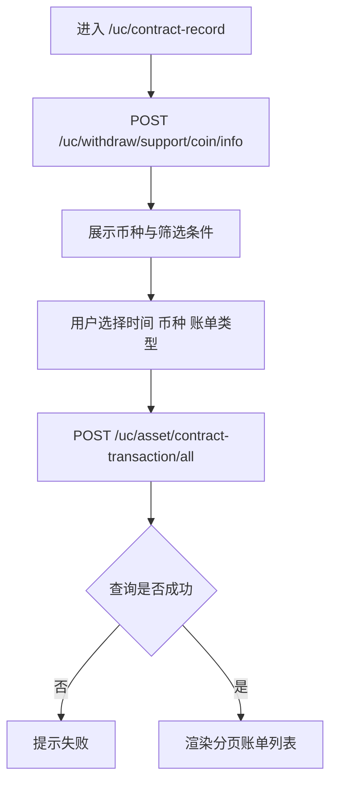

# 永续合约业务流程梳理

本文档基于当前仓库的真实实现梳理永续合约相关业务逻辑，前端以 Vue 3 主链路为准。

## 主要功能点

当前永续合约相关能力，按现行 Vue 3 页面可分为 5 类：

1. `合约交易主页面`
   - 路由：`/swapindex`、`/swapindex/:pair`
   - 页面：`mscoin-frontend/src/pages-vue3/swapindex/Swapindex.vue`
   - 核心能力：合约品种切换、行情展示、盘口/深度、最新成交、开仓、平仓、撤单、闪电平仓、当前持仓、当前委托、历史委托。

2. `合约独立 K 线页`
   - 路由：`/kline/:pair`
   - 页面：`mscoin-frontend/src/pages-vue3/swapindex/Kline.vue`
   - 核心能力：单独展示合约行情与图表，逻辑与交易主页同源，但页面更轻量。

3. `合约资产页`
   - 路由：`/uc/contract-money`
   - 页面：`mscoin-frontend/src/pages-vue3/uc/ContractMoneyIndex.vue`
   - 核心能力：查看合约资产、查看冻结金额、执行现货账户与合约账户划转。

4. `合约委托管理`
   - 路由：`/uc/contract/entrust/current`、`/uc/contract/entrust/history`
   - 页面：
     - `mscoin-frontend/src/pages-vue3/uc/contract/EntrustCurrent.vue`
     - `mscoin-frontend/src/pages-vue3/uc/contract/EntrustHistory.vue`
   - 核心能力：筛选当前委托、撤销当前委托、查看历史委托、按限价委托/计划委托分类查询。

5. `合约账单页`
   - 路由：`/uc/contract-record`
   - 页面：`mscoin-frontend/src/pages-vue3/uc/ContractRecord.vue`
   - 核心能力：按时间、币种、账单类型查询合约流水。

## 合约交易主流程

### 用户操作步骤

1. 用户进入 `/swapindex/:pair`。
2. 页面自动加载当前合约基础信息、最新价、涨跌幅、盘口、成交、K 线。
3. 已登录用户会额外看到合约钱包、当前持仓、当前委托、历史委托、当前杠杆。
4. 用户可以切换合约品种、切换 K 线/深度图、切换当前持仓/当前委托/历史委托。
5. 用户填写开仓或平仓参数后提交委托。
6. 用户可以撤销当前委托，或对已有仓位执行闪电平仓。
7. 页面通过 WebSocket 持续刷新行情、盘口、成交和用户订单状态。

### 业务逻辑说明

1. `页面初始化`
   - `init()` 以路由参数 `pair` 作为合约 ID。
   - 若未传 `pair`，页面直接跳到 `/swapindex/1`。
   - 页面先请求 `/swap/contract-coin/info/:id` 获取合约基础信息，并写入：
     - 交易对符号
     - 合约类型
     - 价格精度、数量精度
     - 每张面值 `shareNumber`
     - taker / maker 手续费
     - 是否允许市价买入、卖出
     - 是否可交易

2. `行情与静态信息加载`
   - 页面随后请求：
     - `/market/exchange-rate/usd/cny` 获取汇率
     - `/market/coin-info` 获取币种说明
     - `/swap/symbol-thumb` 获取合约列表与最新价
     - `/swap/exchange-plate-mini` 获取简版盘口
     - `/swap/exchange-plate-full` 获取深度图盘口
     - `/swap/latest-trade` 获取最新成交
   - `getSymbol()` 会把返回结果写入合约列表，并把当前合约的价格、涨跌幅、成交量同步到页面状态。

3. `登录后附加加载`
   - 若 `store.getters.isLogin` 为真，页面继续请求：
     - `/uc/asset/contract-wallet/USDT` 获取合约钱包余额与冻结金额
     - `/uc/asset/wallet/KICK` 获取 KICK 余额
     - `/swap/order/position` 获取当前持仓
     - `/swap/order-entrust/current` 获取当前委托
     - `/swap/order-entrust/history` 获取历史委托
     - `/swap/contract-leverage` 获取当前杠杆

4. `开仓逻辑`
   - 前端先用 `wallet.base * leverage / perUsdt` 计算最大可开张数。
   - 若下单数量超过最大可开仓数量，前端直接阻断。
   - 然后校验 KICK 手续费余额是否足够，不足则弹窗提示跳转众筹页，否则继续下单。
   - 最终提交到 `/swap/order-entrust/add`，主要字段包括：
     - `contractCoinId`
     - `symbol`
     - `entrustType`
     - `type`
     - `holdTime`
     - `patterns`
     - `leverage`
     - `marketPrice`
     - `entrustPrice`
     - `triggerPrice`
     - `triggerType`
     - `share`
     - `direction`

5. `平仓逻辑`
   - 前端先按当前持仓汇总多仓和空仓的可平数量。
   - 若平仓数量超过对应方向可平数量，前端直接报错。
   - 然后同样提交到 `/swap/order-entrust/add`，但本质上是以平仓参数发起新的委托。

6. `闪电平仓`
   - 仅非 `SECOND` 类型仓位展示闪电平仓按钮。
   - 用户确认后调用 `/swap/order-entrust/quick-close/:id`。
   - 成功后重新刷新钱包、持仓、当前委托、历史委托。

7. `撤单逻辑`
   - 当前委托表格点击撤单后，请求 `/swap/order-entrust/cancel/:id`。
   - 成功后调用 `refreshAccount()`，统一刷新当前委托、历史委托、持仓、钱包。

8. `实时刷新逻辑`
   - 页面通过 `socket.io` 连接 `/socket.io`。
   - 订阅的主题包括：
     - `/topic/swap/thumb`
     - `/topic/swap/trade/{symbol}`
     - `/topic/swap/trade-plate/{symbol}`
     - `/topic/swap/order-canceled/{symbol}/{memberId}`
     - `/topic/swap/order-completed/{symbol}/{memberId}`
     - `/topic/swap/order-trade/{symbol}/{memberId}`
     - `/topic/swap/refresh/{symbol}/{memberId}`
   - 行情、盘口、成交走实时推送，用户订单与持仓变化走事件触发刷新。

9. `持仓盈亏展示`
   - 页面监听 `currentCoin.close`。
   - 每次最新价变化时，前端重新计算每条持仓的 `profit`，并汇总到 `wallet.profit`。
   - 这部分盈亏是前端展示计算，不是后端结算入口。

### 流程图

## 合约资产划转流程

### 用户操作步骤

1. 用户进入 `/uc/contract-money`。
2. 页面展示合约账户资产列表、可用余额、冻结余额、待释放金额。
3. 用户点击某个币种的“划转”按钮。
4. 在弹窗中选择划转方向与数量。
5. 提交后刷新资产列表。

### 业务逻辑说明

1. 页面加载时调用 `/uc/contract-wallet` 拉取合约资产列表。
2. 每条资产会保留：
   - 合约账户余额
   - 合约冻结金额
   - 主账户余额 `mainBalance`
3. 用户点击方向切换，本质是在“现货账户 -> 合约账户”和“合约账户 -> 现货账户”之间切换。
4. 前端按方向选择可划转上限：
   - 转入时以上游主账户余额为上限
   - 转出时以合约账户余额为上限
5. 提交时调用 `/uc/contract-wallet/transfer`，参数包括：
   - `unit`
   - `amount`
   - `direction`
6. 成功后重新请求 `/uc/contract-wallet` 刷新资产。

### 流程图

## 合约委托管理流程

### 用户操作步骤

1. 用户进入 `/uc/contract/entrust/current` 查看当前委托。
2. 可按时间、合约、开平方向筛选。
3. 可在限价委托和计划委托两个 tab 之间切换。
4. 当前委托页可对单条委托执行撤单。
5. 用户进入 `/uc/contract/entrust/history` 查看历史委托。
6. 历史页同样支持筛选与 tab 切换，但不支持撤单。

### 业务逻辑说明

1. 当前委托页调用 `/uc/contract/current` 获取分页数据。
2. 历史委托页调用 `/uc/contract/history` 获取分页数据。
3. 两个页面都会调用 `/uc/contract/coin/thumb` 拉取筛选用的合约列表。
4. 筛选条件主要包括：
   - `contractCoinId`
   - `type`
   - `direction`
   - `entrustType`
   - `startTime`
   - `endTime`
   - `pageNo`
   - `pageSize`
5. “开多、开空、平多、平空”在前端会被拆成 `direction + entrustType` 两个字段后再查询。
6. 当前委托页撤单时调用 `/uc/contract/entrust/cancel/:id`。
7. 当前交易页底部的“当前委托/历史委托”区域，与用户中心委托页不是同一组接口：
   - 交易页走 `/swap/order-entrust/current`、`/swap/order-entrust/history`
   - 用户中心页走 `/uc/contract/current`、`/uc/contract/history`

### 流程图

## 合约账单流程

### 用户操作步骤

1. 用户进入 `/uc/contract-record`。
2. 选择时间范围、币种、账单类型。
3. 点击查询。
4. 分页查看账单记录。

### 业务逻辑说明

1. 页面先调用 `/uc/withdraw/support/coin/info` 获取币种列表。
2. 用户点击查询后，页面调用 `/uc/asset/contract-transaction/all` 拉取账单。
3. 查询参数包括：
   - `pageNo`
   - `pageSize`
   - `startTime`
   - `endTime`
   - `memberId`
   - `symbol`
   - `type`
4. 页面当前把账单类型固定映射为：
   - 0：划入
   - 1：划出
   - 2：结算
   - 3：强平
5. 页面只展示已完成状态，不区分中间状态。

### 流程图

## 永续合约完整流程

从当前实现看，永续合约完整业务链可以概括为：

1. 用户进入合约交易页。
2. 页面根据合约 ID 拉取合约基础信息。
3. 页面拉取静态行情、盘口、成交、币种说明与汇率。
4. 页面建立实时订阅，持续更新价格、盘口、成交。
5. 已登录用户同步拉取合约钱包、KICK 余额、持仓、当前委托、历史委托、杠杆。
6. 用户根据钱包余额、杠杆、面值和手续费状态发起开仓或平仓。
7. 提交后页面依赖订单查询接口和实时事件刷新委托与持仓。
8. 用户可在交易页直接撤单或闪电平仓，也可去用户中心查看更完整的委托和账单。
9. 用户可在用户中心执行现货账户与合约账户划转，划转结果影响后续可开仓能力。

## 当前是否存在旧逻辑与新逻辑共存

存在，而且比较明显；当前应以 Vue 3 页面树为准。

### 1. 页面层面存在 Vue 2 / Vue 3 双份实现

1. 当前启动入口是 `mscoin-frontend/src/main-vue3.js`，加载的是 `src/config/routes-vue3.js`。
2. 仓库里同时仍保留旧页面树与旧路由：
   - `mscoin-frontend/src/pages/swapindex/*`
   - `mscoin-frontend/src/config/routes.js`
3. 因此，永续合约页面层面是“旧页面仍在仓库中保留，现行路由走 Vue 3 页面”。

### 2. Vue 3 内部仍存在两套合约接口风格

1. 合约交易主页面主要走 `/swap/*`：
   - `/swap/contract-coin/info/:id`
   - `/swap/symbol-thumb`
   - `/swap/order-entrust/*`
   - `/swap/order/position`
   - `/swap/contract-leverage`
2. 用户中心合约委托页走 `/uc/contract/*`：
   - `/uc/contract/current`
   - `/uc/contract/history`
   - `/uc/contract/coin/thumb`
   - `/uc/contract/entrust/cancel/:id`
3. 合约资产页又走 `/uc/contract-wallet`、`/uc/contract-wallet/transfer`。
4. 但共享 API 配置 `src/config/api.js` 里定义的合约资产接口是 `/uc/asset/contract-wallet/*`。
5. 这说明在 Vue 3 主链路内部，合约业务并不是一套完全统一的新接口，而是存在多套历史接口风格并存。

### 3. 后端仓库可见实现与前端合约接口并不完全对齐

1. 当前 Go 后端可明确看到：
   - `market-api` 暴露的是 `/market/*` 行情接口。
   - `exchange-api` 暴露的是 `/exchange/order/*` 现货委托接口。
   - `ucenter-api` 暴露的是 `/uc/asset/wallet*`、`/uc/asset/transaction/all` 等通用资产接口。
2. 当前仓库中没有看到与前端 `/swap/*`、`/uc/contract/*`、`/uc/contract-wallet*` 一一对应的 Go HTTP handler。
3. 同时，`mscoin-frontend/dev/localAcceptanceMocks.mjs` 又补了多条合约 mock：
   - `/swap/contract-coin/info/1`
   - `/swap/symbol-thumb`
   - `/swap/order/position`
   - `/swap/order-entrust/current`
   - `/swap/order-entrust/history`
   - `/swap/contract-leverage`
   - `/uc/contract/current`
   - `/uc/contract/history`
   - `/uc/contract/coin/thumb`
4. 所以从当前仓库可见实现看，永续合约在“前端现行 Vue 3 页面 + 若干兼容接口/本地 mock”之间运行，后端 Go 服务中没有形成同等清晰、完整、统一的合约 HTTP 接口面。

## 结论

1. 当前永续合约的现行业务入口，以 Vue 3 页面为准，核心页面是 `pages-vue3/swapindex` 和用户中心下的合约资产、委托、账单页。
2. 主交易流程已经具备“看行情、看盘口、看成交、开仓、平仓、撤单、闪电平仓、查持仓、查委托”的完整前端链路。
3. 用户中心补齐了“资产划转、委托管理、账单查询”的外围流程。
4. 旧逻辑与新逻辑确实共存：
   - 页面层面：Vue 2 与 Vue 3 共存，但运行时以 Vue 3 为准。
   - 接口层面：`/swap/*`、`/uc/contract/*`、`/uc/contract-wallet*`、`/uc/asset/contract-wallet*` 多套风格并存。
5. 若后续继续做合约梳理或改造，建议先把“当前交易页接口链路”和“用户中心接口链路”拆开看，否则容易把两套兼容逻辑混在一起。
