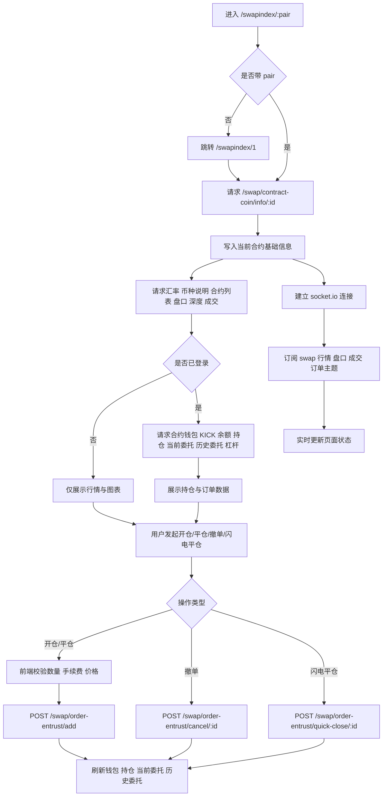
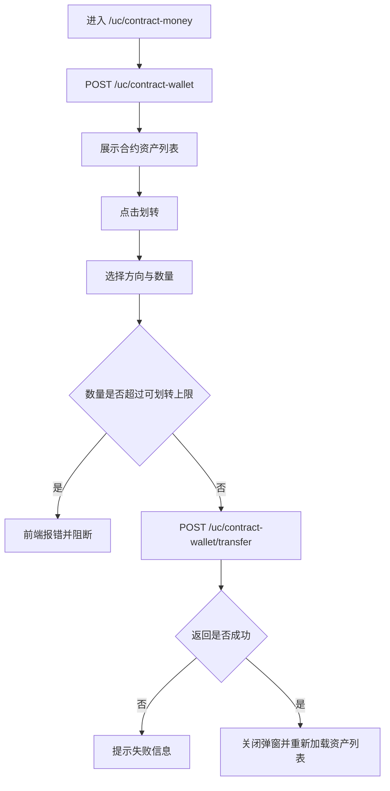
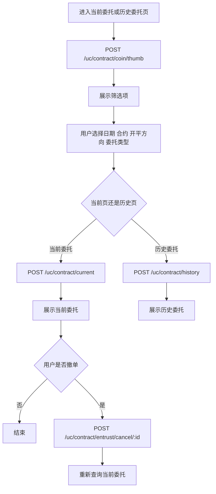
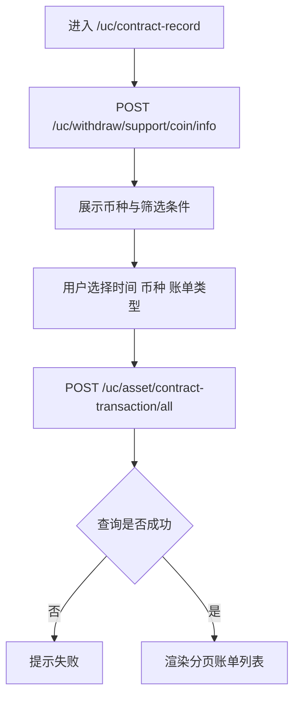

# 永续合约业务流程梳理

本文档基于当前仓库的真实实现梳理永续合约相关业务逻辑，前端以 Vue 3 主链路为准。

---

## 第一部分：核心概念与术语解释

### 1.1 什么是永续合约 (Perpetual Contract)

**定义**：永续合约是一种**无到期日**的加密货币衍生品，允许交易者通过杠杆持续持有资产敞口，无需实际交割。

**核心特点**：
- 没有到期日，可以无限期持有（只要不被强平）
- 支持多空双向交易（开多/开空）
- 支持杠杆交易（借入资金放大收益/亏损）
- 通过资金费率机制锚定现货价格

**在 MSCOIN 项目中的标识**：`contractCoinType === 'ALWAYS'`

---

### 1.2 什么是秒合约 (Seconds Contract)

**定义**：秒合约是永续合约的一种特殊类型，属于**二元期权**的变种，具有固定持有时间，到期自动结算。

**核心特点**：
- 固定持有时间（如 30 秒、60 秒）
- 开仓时即确定预期收益率
- 到期自动结算，无需手动平仓
- 收益在开仓时显示，而非平仓时

**在 MSCOIN 项目中的标识**：`contractCoinType === 'SECOND'`

**显示格式**：`BTC.30SEC.10X`（币种。持有时间。杠杆）

---

### 1.3 永续合约 vs 秒合约 对比表

| 特性 | 永续合约 (ALWAYS) | 秒合约 (SECOND) |
|------|-----------------|---------------|
| **持有时间** | 无限制，可随时平仓 | 固定时间（如 30 秒），到期自动结算 |
| **盈亏计算** | 平仓时结算：(平仓价 - 开仓价) × 数量 | 开仓时确定收益率，到期按预设规则结算 |
| **收益显示** | 持仓期间显示未实现盈亏，平仓后实现盈亏 | 开仓时即显示预期收益 |
| **平仓方式** | 用户主动平仓（手动或闪电） | 到期自动结算 |
| **显示格式** | `BTC.10X` | `BTC.30SEC.10X` |
| **本质** | 金融衍生品工具 | 类赌博性质的二元期权 |
| **盈亏决定** | 价格涨跌的**幅度** | 只看**方向对错**，与幅度无关 |
| **期望值** | 理论上可正可负（取决于判断能力） | 长期为负（赔付率<100%） |

---

### 1.4 专业术语解释

| 术语 | 解释 | 举例 |
|------|------|------|
| **开多** | 判断价格会**涨**，买入做多 | BTC=10 万，认为会涨到 11 万 → 开多 |
| **开空** | 判断价格会**跌**，卖出做空 | BTC=10 万，认为会跌到 9 万 → 开空 |
| **开仓** | 投入本金，建立仓位 | 投入 100 USDT 开仓 |
| **平仓** | 卖出/买回，结束仓位，结算盈亏 | 卖掉仓位，盈亏落袋 |
| **持仓** | 开仓后未平仓的状态 | 持有 10 手 BTC 多仓 |
| **多仓** | 买入开仓的仓位（方向=BUY） | 开多后持有的是多仓 |
| **空仓** | 卖出开仓的仓位（方向=SELL） | 开空后持有的是空仓 |
| **手** | 合约的**数量单位**（像"斤"） | 1 手 = 0.001 BTC（合约面值） |
| **杠杆** | 放大资金的**倍数**（像借钱炒股） | 10 倍杠杆 = 出 1 份钱，平台借 9 份 |
| **保证金** | 开仓需要的本金 | 1000U 合约，10 倍杠杆 = 100U 保证金 |
| **可用余额** | 钱包中可以用于开仓的资金 | `wallet.balance` |
| **冻结余额** | 开仓后被占用的保证金 | `wallet.frozen` |
| **未实现盈亏** | 持仓期间的浮动盈亏（未结算） | `(当前价 - 开仓价) × 数量` |
| **已实现盈亏** | 平仓后实际获得的盈亏 | 平仓后计入钱包余额 |
| **爆仓/强平** | 保证金不足时，平台强制平仓 | 本金快亏光时触发 |
| **穿仓** | 极端行情下，强平后仍倒欠平台钱 | BTC 闪崩，跳过强平价 |
| **限价委托** | 指定价格成交（`type=2`） | 10 万买入，只在这个价成交 |
| **市价委托** | 按市场最优价立即成交（`type=3`） | 不管价格，立刻买入 |
| **计划委托** | 触发价格后转为限价/市价单 | 突破 11 万后买入 |
| **闪电平仓** | 一键平仓所有持仓 | `quick-close` 接口 |
| **资金费率** | 永续合约锚定现货的机制 | 多付空或空付多 |
| **合约** | 平台制定的标准化交易规则 | BTCUSDT 永续合约产品 |

---

### 1.5 "手"与"杠杆"的区别（重要！）

**常见误解**：❌ "1 手=10 倍杠杆，2 手=20 倍"

**正确理解**：
- **手** = 合约数量单位（像买菜说"斤"）
- **杠杆** = 放大倍数（像借钱炒股）
- 两者**完全独立**，可以任意组合

```
示例：
- 1 手 + 1 倍杠杆（不借钱，买 0.001 BTC）
- 1 手 + 100 倍杠杆（借 99 倍，买 0.001 BTC）
- 100 手 + 10 倍杠杆（大仓位 + 适度杠杆）
```

---

### 1.6 "合约"的含义（重要！）

这里的"合约"**不是**Solidity 智能合约，而是**传统金融衍生品**的概念。

```
合约 = 您和平台之间的标准化交易协议

包括：
1. 交易什么？      → BTC/USDT
2. 多少钱 1 手？    → 1 手 = 0.001 BTC
3. 可以开多大杠杆？ → 1-100 倍
4. 手续费多少？    → 挂单 0.02%，吃单 0.05%
5. 什么类型？      → 永续合约/秒合约
```

**数据库字段**（`contract_coins` 表）：
```go
type ContractCoin struct {
    Symbol          string  // 交易对符号，如"BTCUSDT"
    ContractType    int32   // 合约类型（永续/秒合约）
    ShareNumber     float64 // 每手合约的面值（如 0.001 BTC）
    MinLeverage     int32   // 最小杠杆倍数
    MaxLeverage     int32   // 最大杠杆倍数
    MakerFee        float64 // 挂单手续费率
    TakerFee        float64 // 吃单手续费率
    Status          int32   // 状态（1=正常交易）
}
```

---

## 第二部分：计算逻辑与爆仓机制

### 2.1 永续合约计算逻辑

#### 开仓计算

```
公式：
合约数量 = 手数 × 每手面值
合约总价值 = 合约数量 × 开仓价格
所需保证金 = 合约总价值 / 杠杆倍数

示例（10 倍杠杆开多）：
- 本金：100 USDT
- 开 10 手 BTC，每手 0.001 BTC → 合约数量 = 0.01 BTC
- BTC 价格：100,000 USDT
- 合约总价值 = 0.01 × 100,000 = 1,000 USDT
- 所需保证金 = 1,000 / 10 = 100 USDT

账户变化：
开仓前：余额 = 1000 USDT, 冻结 = 0 USDT
开仓后：余额 = 900 USDT, 冻结 = 100 USDT
```

#### 盈亏计算

```
多仓（Direction=BUY）：
未实现盈亏 = (当前价格 - 开仓价格) × 持仓数量

空仓（Direction=SELL）：
未实现盈亏 = (开仓价格 - 当前价格) × 持仓数量

示例（多仓）：
- 开仓价：100,000 USDT
- 当前价：105,000 USDT
- 持仓：0.01 BTC
- 未实现盈亏 = (105,000 - 100,000) × 0.01 = 50 USDT (盈利)

示例（空仓）：
- 开仓价：100,000 USDT
- 当前价：95,000 USDT
- 持仓：0.01 BTC
- 未实现盈亏 = (100,000 - 95,000) × 0.01 = 50 USDT (盈利)
```

#### 平仓计算

```
平仓后账户变化：
- 返还冻结保证金
- 加上/减去实现盈亏

示例：
平仓前：余额 = 900 USDT, 冻结 = 100 USDT, 未实现盈亏 = +50 USDT
平仓后：
  - 返还冻结保证金：100 USDT
  - 实现盈利：50 USDT
  最终余额 = 900 + 100 + 50 = 1050 USDT, 冻结 = 0 USDT
```

---

### 2.2 秒合约计算逻辑

```
秒合约收益计算（简化模型）：
投资金额 = 开仓投入
预期收益率 = 预设年化收益率 × 持有时间 / 年
预期收益 = 投资金额 × 预期收益率

示例（30 秒秒合约）：
- 投资：100 USDT
- 预设年化：100%
- 30 秒收益率 = (100% / 365 / 24 / 3600) × 30 ≈ 0.000095%
- 预期收益 = 100 × 0.000095% ≈ 0.000095 USDT

结算规则：
- 到期时价格 >= 开仓价：获得预期收益
- 到期时价格 < 开仓价：可能损失部分或全部本金
```

**注意**：实际秒合约的收益率计算可能更复杂，通常基于预设的固定收益率或市场条件。秒合约更接近二元期权，收益是固定比例的，而不是由涨跌幅决定。

---

### 2.3 爆仓（强平）机制

#### 为什么会爆仓？

```
因为您借了平台的钱！

开仓时：
- 您出 100 USDT（保证金）
- 平台借您 900 USDT
- 买入 1,000 USDT 的 BTC

平台要确保能收回借出的 900 USDT，所以：
- 当您的本金快亏光时（比如只剩 10 USDT）
- 平台强制卖掉仓位，收回 900 USDT
- 您剩下的 10 USDT 也亏掉 → 本金归零
```

#### 爆仓计算（10 倍杠杆）

```
本金：100 USDT
10 倍杠杆开多 @ 100,000，仓位价值 = 1,000 USDT

构成：
- 您的保证金：100 USDT
- 借入资金：900 USDT

当 BTC 跌到 91,000 时：
- 仓位价值 = 0.01 × 91,000 = 910 USDT
- 亏损 = (100,000 - 91,000) × 0.01 = 90 USDT
- 剩余保证金 = 100 - 90 = 10 USDT
- 保证金比率 = 10 / 100 = 10%

如果平台强平线是 10% → 触发爆仓！
```

#### 强平价格计算公式

```
多仓强平价 ≈ 开仓价 × (1 - 1/杠杆倍数)
空仓强平价 ≈ 开仓价 × (1 + 1/杠杆倍数)

示例：
- 10 倍杠杆开多 @ 100,000
  强平价 ≈ 100,000 × (1 - 1/10) = 90,000（下跌 10% 爆仓）

- 100 倍杠杆开多 @ 100,000
  强平价 ≈ 100,000 × (1 - 1/100) = 99,000（下跌 1% 爆仓）→ 高风险！
```

#### 代码中的爆仓逻辑

```go
// jobcenter/internal/logic/swap_liquidation.go:130-136

// 保证金比率 = (保证金 + 未实现盈亏) / 所需保证金
marginRatio := (position.Margin + unrealizedPnl) / requiredMargin

// 当保证金比率低于清算阈值时，强制平仓
if marginRatio < l.config.LiquidationRatio || currentPrice <= position.LiquidationPrice {
    l.executeLiquidation(ctx, position)  // 执行强平
}
```

#### 爆仓执行

```go
// swap_liquidation.go:180-184

// 更新钱包余额
newBalance := wallet.Balance + unrealizedPnl
if newBalance < 0 {
    newBalance = 0  // 防止余额变负数
}

// 清空持仓
position.Size = 0
position.UnrealizedPnl = 0
position.Margin = 0
```

---

### 2.4 穿仓风险

**极端情况**：强平可能无法在理想价格执行

```
场景：BTC 闪崩

您的仓位：
- 本金：100 USDT
- 10 倍杠杆开多 @ 100,000
- 强平价：91,000

实际情况：
- BTC 从 92,000 直接跳到 85,000（跳过强平价）
- 平台在 85,000 才强平成功
- 亏损 = (100,000 - 85,000) × 0.01 = 150 USDT
- 本金只有 100 USDT → 倒欠平台 50 USDT！
```

**各平台处理方式**：

| 平台 | 穿仓处理 |
|------|---------|
| **币安** | 风险保险基金覆盖，用户不欠钱 |
| **OKX** | 阶梯强平 + 保险基金 |
| **小型平台** | 可能要求用户补足穿仓差额 |

---

## 第三部分：主要功能点

当前永续合约相关能力，按前端 Vue 3 页面可分为 5 类：

1. **合约交易主页面**
   - 路由：`/swapindex`、`/swapindex/:pair`
   - 页面：`mscoin-frontend/src/pages-vue3/swapindex/Swapindex.vue`
   - 核心能力：合约品种切换、行情展示、盘口/深度、最新成交、开仓、平仓、撤单、闪电平仓、当前持仓、当前委托、历史委托。

2. **合约独立 K 线页**
   - 路由：`/kline/:pair`
   - 页面：`mscoin-frontend/src/pages-vue3/swapindex/Kline.vue`
   - 核心能力：单独展示合约行情与图表，逻辑与交易主页同源，但页面更轻量。

3. **合约资产页**
   - 路由：`/uc/contract-money`
   - 页面：`mscoin-frontend/src/pages-vue3/uc/ContractMoneyIndex.vue`
   - 核心能力：查看合约资产、查看冻结金额、执行现货账户与合约账户划转。

4. **合约委托管理**
   - 路由：`/uc/contract/entrust/current`、`/uc/contract/entrust/history`
   - 页面：
     - `mscoin-frontend/src/pages-vue3/uc/contract/EntrustCurrent.vue`
     - `mscoin-frontend/src/pages-vue3/uc/contract/EntrustHistory.vue`
   - 核心能力：筛选当前委托、撤销当前委托、查看历史委托、按限价委托/计划委托分类查询。

5. **合约账单页**
   - 路由：`/uc/contract-record`
   - 页面：`mscoin-frontend/src/pages-vue3/uc/ContractRecord.vue`
   - 核心能力：按时间、币种、账单类型查询合约流水。

---

## 第四部分：合约交易主流程

### 用户操作步骤

1. 用户进入 `/swapindex/:pair`。
2. 页面自动加载当前合约基础信息、最新价、涨跌幅、盘口、成交、K 线。
3. 已登录用户会额外看到合约钱包、当前持仓、当前委托、历史委托、当前杠杆。
4. 用户可以切换合约品种、切换 K 线/深度图、切换当前持仓/当前委托/历史委托。
5. 用户填写开仓或平仓参数后提交委托。
6. 用户可以撤销当前委托，或对已有仓位执行闪电平仓。
7. 页面通过 WebSocket 持续刷新行情、盘口、成交和用户订单状态。

### 业务逻辑说明

1. **页面初始化**
   - `init()` 以路由参数 `pair` 作为合约 ID。
   - 若未传 `pair`，页面直接跳到 `/swapindex/1`。
   - 页面先请求 `/swap/contract-coin/info/:id` 获取合约基础信息，并写入：
     - 交易对符号
     - 合约类型（ALWAYS/SECOND）
     - 价格精度、数量精度
     - 每张面值 `shareNumber`
     - taker / maker 手续费
     - 是否允许市价买入、卖出
     - 是否可交易

2. **行情与静态信息加载**
   - 页面随后请求：
     - `/market/exchange-rate/usd/cny` 获取汇率
     - `/market/coin-info` 获取币种说明
     - `/swap/symbol-thumb` 获取合约列表与最新价
     - `/swap/exchange-plate-mini` 获取简版盘口
     - `/swap/exchange-plate-full` 获取深度图盘口
     - `/swap/latest-trade` 获取最新成交
   - `getSymbol()` 会把返回结果写入合约列表，并把当前合约的价格、涨跌幅、成交量同步到页面状态。

3. **登录后附加加载**
   - 若 `store.getters.isLogin` 为真，页面继续请求：
     - `/uc/asset/contract-wallet/USDT` 获取合约钱包余额与冻结金额
     - `/uc/asset/wallet/KICK` 获取 KICK 余额
     - `/swap/order/position` 获取当前持仓
     - `/swap/order-entrust/current` 获取当前委托
     - `/swap/order-entrust/history` 获取历史委托
     - `/swap/contract-leverage` 获取当前杠杆

4. **开仓逻辑**
   - 前端先用 `wallet.base * leverage / perUsdt` 计算最大可开张数。
   - 若下单数量超过最大可开仓数量，前端直接阻断。
   - 然后校验 KICK 手续费余额是否足够，不足则弹窗提示跳转众筹页，否则继续下单。
   - 最终提交到 `/swap/order-entrust/add`，主要字段包括：
     - `contractCoinId`
     - `symbol`
     - `entrustType` (1=开仓，2=平仓)
     - `type` (2=限价，3=市价)
     - `holdTime` (秒合约特有)
     - `patterns`
     - `leverage`
     - `marketPrice`
     - `entrustPrice`
     - `triggerPrice`
     - `triggerType`
     - `share`
     - `direction` (1=BUY/多，2=SELL/空)

5. **平仓逻辑**
   - 前端先按当前持仓汇总多仓和空仓的可平数量。
   - 若平仓数量超过对应方向可平数量，前端直接报错。
   - 然后同样提交到 `/swap/order-entrust/add`，但 `entrustType=2`（平仓）。

6. **闪电平仓**
   - 仅非 `SECOND` 类型仓位展示闪电平仓按钮。
   - 用户确认后调用 `/swap/order-entrust/quick-close/:id`。
   - 成功后重新刷新钱包、持仓、当前委托、历史委托。

7. **撤单逻辑**
   - 当前委托表格点击撤单后，请求 `/swap/order-entrust/cancel/:id`。
   - 成功后调用 `refreshAccount()`，统一刷新当前委托、历史委托、持仓、钱包。

8. **实时刷新逻辑**
   - 页面通过 `socket.io` 连接 `/socket.io`。
   - 订阅的主题包括：
     - `/topic/swap/thumb`
     - `/topic/swap/trade/{symbol}`
     - `/topic/swap/trade-plate/{symbol}`
     - `/topic/swap/order-canceled/{symbol}/{memberId}`
     - `/topic/swap/order-completed/{symbol}/{memberId}`
     - `/topic/swap/order-trade/{symbol}/{memberId}`
     - `/topic/swap/refresh/{symbol}/{memberId}`
   - 行情、盘口、成交走实时推送，用户订单与持仓变化走事件触发刷新。

9. **持仓盈亏展示**
   - 页面监听 `currentCoin.close`。
   - 每次最新价变化时，前端重新计算每条持仓的 `profit`，并汇总到 `wallet.profit`。
   - 这部分盈亏是前端展示计算，不是后端结算入口。

### 流程图



---

## 第五部分：完整交易案例

### 案例 1：永续合约开多

**场景**：小明有 1000 USDT 合约账户余额，BTC=100,000 USDT，决定开多 10 手 BTC 永续合约，10 倍杠杆。

**计算**：
```
合约数量 = 10 手 × 0.001 BTC/手 = 0.01 BTC
合约总价值 = 0.01 BTC × 100,000 USDT/BTC = 1,000 USDT
所需保证金 = 合约总价值 / 杠杆 = 1,000 / 10 = 100 USDT

账户变化：
开仓前：余额 = 1000 USDT, 冻结 = 0 USDT
开仓后：余额 = 900 USDT, 冻结 = 100 USDT
```

**持仓期间**（BTC 涨到 105,000）：
```
未实现盈亏 = (当前价 - 开仓价) × 持仓数量
           = (105,000 - 100,000) × 0.01
           = 50 USDT (盈利)

账户权益 = 余额 + 冻结 + 未实现盈亏
         = 900 + 100 + 50 = 1050 USDT
```

**平仓**（以 105,000 市价平仓）：
```
平仓后：
  - 返还冻结保证金：100 USDT
  - 实现盈利：50 USDT
  最终余额 = 900 + 100 + 50 = 1050 USDT, 冻结 = 0 USDT
```

---

### 案例 2：永续合约开空

**场景**：小明决定开空 10 手 BTC，其他条件相同。

**开仓**：
```
所需保证金 = 100 USDT
账户变化：余额 = 900 USDT, 冻结 = 100 USDT
```

**持仓期间**（BTC 跌到 95,000）：
```
未实现盈亏 = (开仓价 - 当前价) × 持仓数量
           = (100,000 - 95,000) × 0.01
           = 50 USDT (盈利)
```

---

### 案例 3：秒合约交易

**场景**：小明买入 100 USDT 的 BTC.30SEC.10X 秒合约。

**开仓**：
```
投资金额 = 100 USDT
持有时间 = 30 秒
预期收益率 = 预设值（如 80% 赔付率）

账户变化：
开仓前：余额 = 1000 USDT
开仓后：余额 = 900 USDT
```

**到期结算**：
```
情况 A（猜对）：
  - 30 秒后价格 > 开仓价
  - 获得收益 = 100 × 80% = 80 USDT
  - 最终余额 = 900 + 100 + 80 = 1080 USDT

情况 B（猜错）：
  - 30 秒后价格 < 开仓价
  - 损失本金 = 100 USDT
  - 最终余额 = 900 USDT
```

---

## 第六部分：合约资产划转流程

### 用户操作步骤

1. 用户进入 `/uc/contract-money`。
2. 页面展示合约账户资产列表、可用余额、冻结余额、待释放金额。
3. 用户点击某个币种的"划转"按钮。
4. 在弹窗中选择划转方向与数量。
5. 提交后刷新资产列表。

### 业务逻辑说明

1. 页面加载时调用 `/uc/contract-wallet` 拉取合约资产列表。
2. 每条资产会保留：
   - 合约账户余额
   - 合约冻结金额
   - 主账户余额 `mainBalance`
3. 用户点击方向切换，本质是在"现货账户 -> 合约账户"和"合约账户 -> 现货账户"之间切换。
4. 前端按方向选择可划转上限：
   - 转入时以上游主账户余额为上限
   - 转出时以合约账户余额为上限
5. 提交时调用 `/uc/contract-wallet/transfer`，参数包括：
   - `unit`
   - `amount`
   - `direction`
6. 成功后重新请求 `/uc/contract-wallet` 刷新资产。

### 流程图



---

## 第七部分：合约委托管理流程

### 用户操作步骤

1. 用户进入 `/uc/contract/entrust/current` 查看当前委托。
2. 可按时间、合约、开平方向筛选。
3. 可在限价委托和计划委托两个 tab 之间切换。
4. 当前委托页可对单条委托执行撤单。
5. 用户进入 `/uc/contract/entrust/history` 查看历史委托。
6. 历史页同样支持筛选与 tab 切换，但不支持撤单。

### 业务逻辑说明

1. 当前委托页调用 `/uc/contract/current` 获取分页数据。
2. 历史委托页调用 `/uc/contract/history` 获取分页数据。
3. 两个页面都会调用 `/uc/contract/coin/thumb` 拉取筛选用的合约列表。
4. 筛选条件包括：
   - `contractCoinId`
   - `type`
   - `direction`
   - `entrustType`
   - `startTime`
   - `endTime`
   - `pageNo`
   - `pageSize`
5. "开多、开空、平多、平空"在前端会被拆成 `direction + entrustType` 两个字段后再查询。
6. 当前委托页撤单时调用 `/uc/contract/entrust/cancel/:id`。
7. 当前交易页底部的"当前委托/历史委托"区域，与用户中心委托页不是同一组接口：
   - 交易页走 `/swap/order-entrust/current`、`/swap/order-entrust/history`
   - 用户中心页走 `/uc/contract/current`、`/uc/contract/history`

### 流程图



---

## 第八部分：合约账单流程

### 用户操作步骤

1. 用户进入 `/uc/contract-record`。
2. 选择时间范围、币种、账单类型。
3. 点击查询。
4. 分页查看账单记录。

### 业务逻辑说明

1. 页面先调用 `/uc/withdraw/support/coin/info` 获取币种列表。
2. 用户点击查询后，页面调用 `/uc/asset/contract-transaction/all` 拉取账单。
3. 查询参数包括：
   - `pageNo`
   - `pageSize`
   - `startTime`
   - `endTime`
   - `memberId`
   - `symbol`
   - `type`
4. 页面当前把账单类型固定映射为：
   - 0：划入
   - 1：划出
   - 2：结算
   - 3：强平
5. 页面只展示已完成状态，不区分中间状态。

### 流程图



---

## 第九部分：永续合约完整流程

从当前实现看，永续合约完整业务链可以概括为：

1. 用户进入合约交易页。
2. 页面根据合约 ID 拉取合约基础信息。
3. 页面拉取静态行情、盘口、成交、币种说明与汇率。
4. 页面建立实时订阅，持续更新价格、盘口、成交。
5. 已登录用户同步拉取合约钱包、KICK 余额、持仓、当前委托、历史委托、杠杆。
6. 用户根据钱包余额、杠杆、面值和手续费状态发起开仓或平仓。
7. 提交后页面依赖订单查询接口和实时事件刷新委托与持仓。
8. 用户可在交易页直接撤单或闪电平仓，也可去用户中心查看更完整的委托和账单。
9. 用户可在用户中心执行现货账户与合约账户划转，划转结果影响后续可开仓能力。

---

## 第十部分：系统架构

### 后端服务架构

```
┌─────────────────────────────────────────────────────────┐
│                    前端 (Vue 3)                          │
│  swapindex.vue → routes-vue3.js → API 调用              │
└─────────────────────────────────────────────────────────┘
                          ↓ HTTP (:8086)
┌─────────────────────────────────────────────────────────┐
│                 swap-api (HTTP API Gateway)             │
│  handler/ → logic/ → dao/ → RPC Client                  │
└─────────────────────────────────────────────────────────┘
                          ↓ gRPC
┌─────────────────────────────────────────────────────────┐
│                   swap (gRPC Server :8085)              │
│  server/ → logic/ → dao/ → MySQL/MongoDB                │
└─────────────────────────────────────────────────────────┘
                          ↓
┌─────────────────────────────────────────────────────────┐
│                jobcenter (后台任务)                       │
│  - swap_kline.go      (K 线生成)                         │
│  - swap_liquidation.go  (强平清算)                       │
│  - swap_price_cache.go  (价格缓存)                       │
└─────────────────────────────────────────────────────────┘
```

### 核心数据表 (MySQL)

| 表名 | 说明 |
|------|------|
| `contract_coins` | 合约品种配置（币种、杠杆倍数、类型 ALWAYS/SECOND） |
| `contract_wallets` | 合约钱包（用户保证金账户） |
| `contract_orders` | 合约订单（委托信息） |
| `contract_positions` | 合约持仓（用户持仓状态） |
| `contract_transactions` | 合约交易流水（账单记录） |

---

## 第十一部分：当前是否存在旧逻辑与新逻辑共存

存在，而且比较明显；当前应以 Vue 3 页面树为准。

### 1. 页面层面存在 Vue 2 / Vue 3 双份实现

1. 当前启动入口是 `mscoin-frontend/src/main-vue3.js`，加载的是 `src/config/routes-vue3.js`。
2. 仓库里同时仍保留旧页面树与旧路由：
   - `mscoin-frontend/src/pages/swapindex/*`
   - `mscoin-frontend/src/config/routes.js`
3. 因此，永续合约页面层面是"旧页面仍在仓库中保留，现行路由走 Vue 3 页面"。

### 2. Vue 3 内部仍存在两套合约接口风格

1. 合约交易主页面主要走 `/swap/*`：
   - `/swap/contract-coin/info/:id`
   - `/swap/symbol-thumb`
   - `/swap/order-entrust/*`
   - `/swap/order/position`
   - `/swap/contract-leverage`
2. 用户中心合约委托页走 `/uc/contract/*`：
   - `/uc/contract/current`
   - `/uc/contract/history`
   - `/uc/contract/coin/thumb`
   - `/uc/contract/entrust/cancel/:id`
3. 合约资产页又走 `/uc/contract-wallet`、`/uc/contract-wallet/transfer`。
4. 但共享 API 配置 `src/config/api.js` 里定义的合约资产接口是 `/uc/asset/contract-wallet/*`。
5. 这说明在 Vue 3 主链路内部，合约业务并不是一套完全统一的新接口，而是存在多套历史接口风格并存。

### 3. 后端仓库可见实现与前端合约接口并不完全对齐

1. 当前 Go 后端可明确看到：
   - `market-api` 暴露的是 `/market/*` 行情接口。
   - `exchange-api` 暴露的是 `/exchange/order/*` 现货委托接口。
   - `ucenter-api` 暴露的是 `/uc/asset/wallet*`、`/uc/asset/transaction/all` 等通用资产接口。
2. 当前仓库中没有看到与前端 `/swap/*`、`/uc/contract/*`、`/uc/contract-wallet*` 一一对应的 Go HTTP handler。
3. 同时，`mscoin-frontend/dev/localAcceptanceMocks.mjs` 又补了多条合约 mock：
   - `/swap/contract-coin/info/1`
   - `/swap/symbol-thumb`
   - `/swap/order/position`
   - `/swap/order-entrust/current`
   - `/swap/order-entrust/history`
   - `/swap/contract-leverage`
   - `/uc/contract/current`
   - `/uc/contract/history`
   - `/uc/contract/coin/thumb`
4. 所以从当前仓库可见实现看，永续合约在"前端现行 Vue 3 页面 + 若干兼容接口/本地 mock"之间运行，后端 Go 服务中没有形成同等清晰、完整、统一的合约 HTTP 接口面。

---

## 第十二部分：结论

1. 当前永续合约的现行业务入口，以 Vue 3 页面为准，核心页面是 `pages-vue3/swapindex` 和用户中心下的合约资产、委托、账单页。
2. 主交易流程已经具备"看行情、看盘口、看成交、开仓、平仓、撤单、闪电平仓、查持仓、查委托"的完整前端链路。
3. 用户中心补齐了"资产划转、委托管理、账单查询"的外围流程。
4. 旧逻辑与新逻辑确实共存：
   - 页面层面：Vue 2 与 Vue 3 共存，但运行时以 Vue 3 为准。
   - 接口层面：`/swap/*`、`/uc/contract/*`、`/uc/contract-wallet*`、`/uc/asset/contract-wallet*` 多套风格并存。
5. 若后续继续做合约梳理或改造，建议先把"当前交易页接口链路"和"用户中心接口链路"拆开看，否则容易把两套兼容逻辑混在一起。

---

## 附录：参考资料

- [二元期权交易应用 - 2025 年最佳策略和平台 - Binance](https://www.binance.com/zh-CN/square/post/27704007169473)
- [2025 年 9 个最佳加密货币合约交易平台– 利用杠杆交易加密货币 - 知乎](https://zhuanlan.zhihu.com/p/1898769238329635815)
- [永续合约简史与未来 - CryptoRank](https://cryptorank.io/news/feed/b9bcc-2252660)
- [深入了解在 2025 年重塑加密货币的永续合约去中心化交易所 - Bitcoin.com](https://news.bitcoin.com/zh/hyperliquid-xiangjie-shenru-liaojie-zai-2025-nian-zhongsu-jiamihuo-bi-de-yongxu-heyue-quzhongxin-jiaoyisuo/)
- [虚拟货币合约交易怎么玩_秒合约交易什么规则 - WiKiBit](https://news.wikibit.com/zh-cn/202303032224305119.html)
- [什么是比特币二元期权（秒合约）？ - 币安广场](https://www.binance.com/zh-CN/square/post/9999442251561)
- [加密货币二元期权：交易机制与风险 - Gate.com](https://www.gate.com/zh/post/status/16869718)
