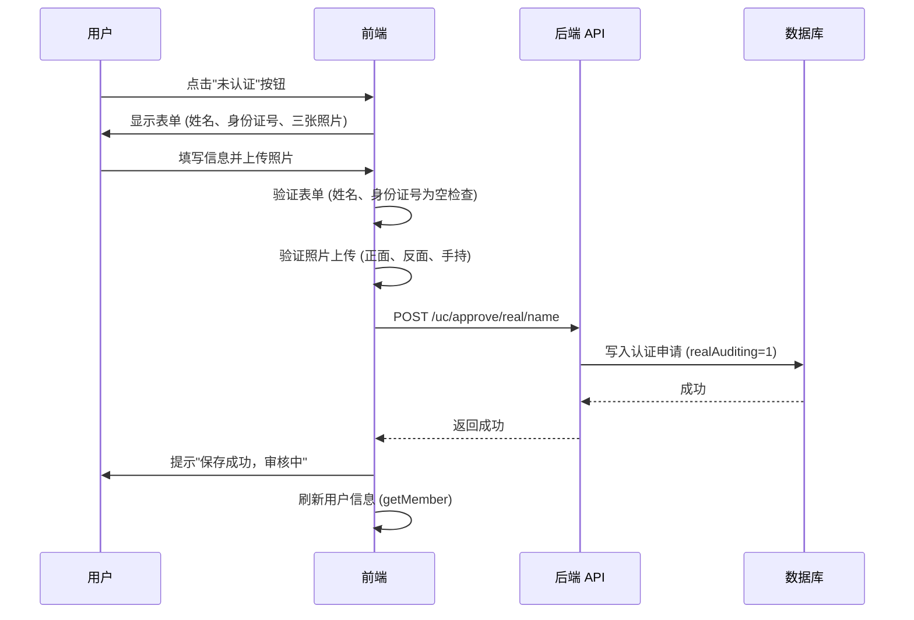
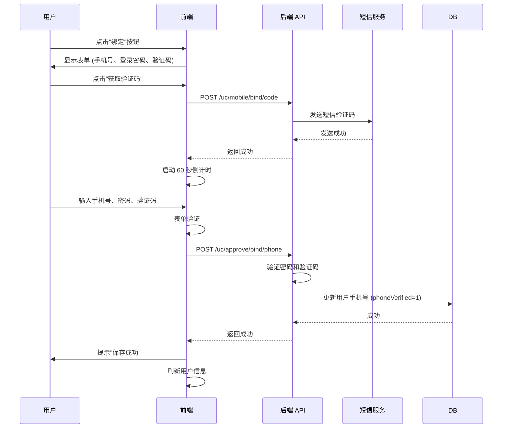
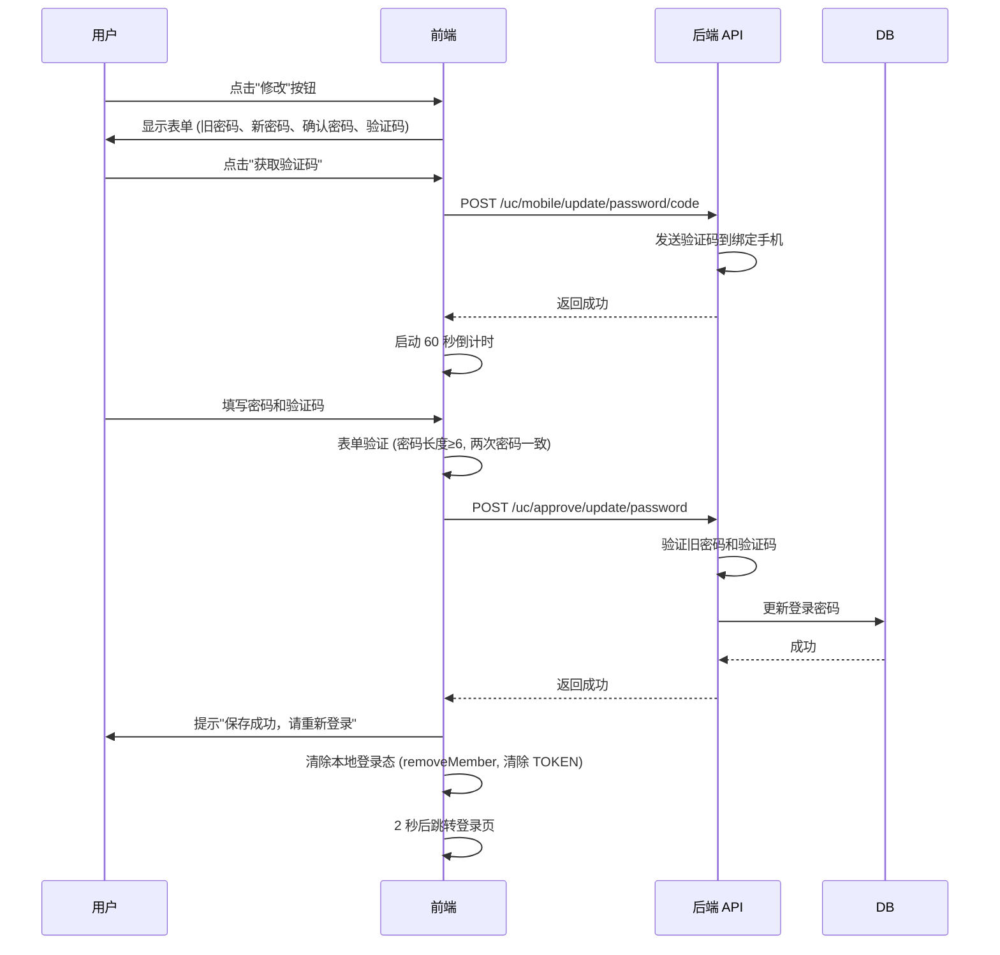
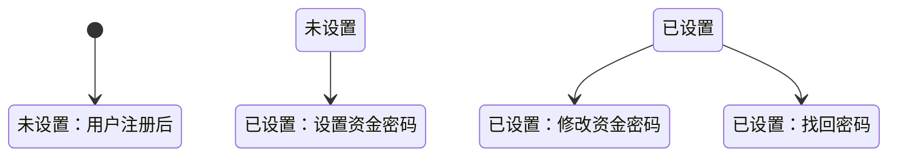
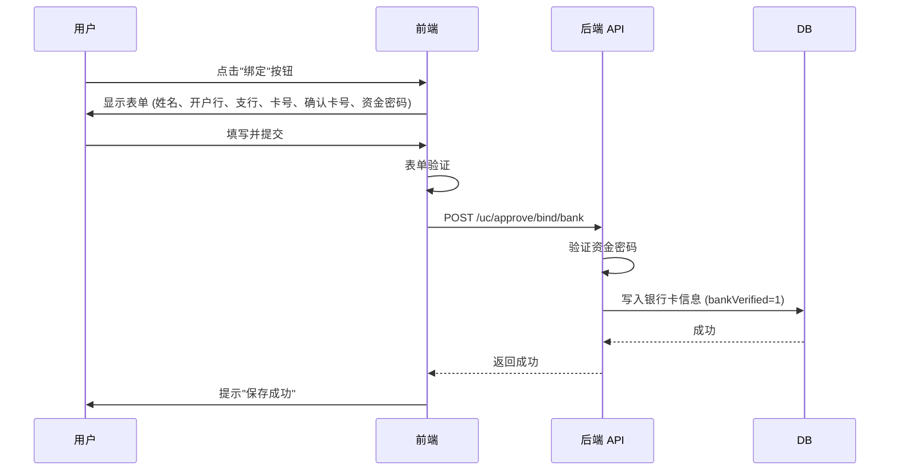
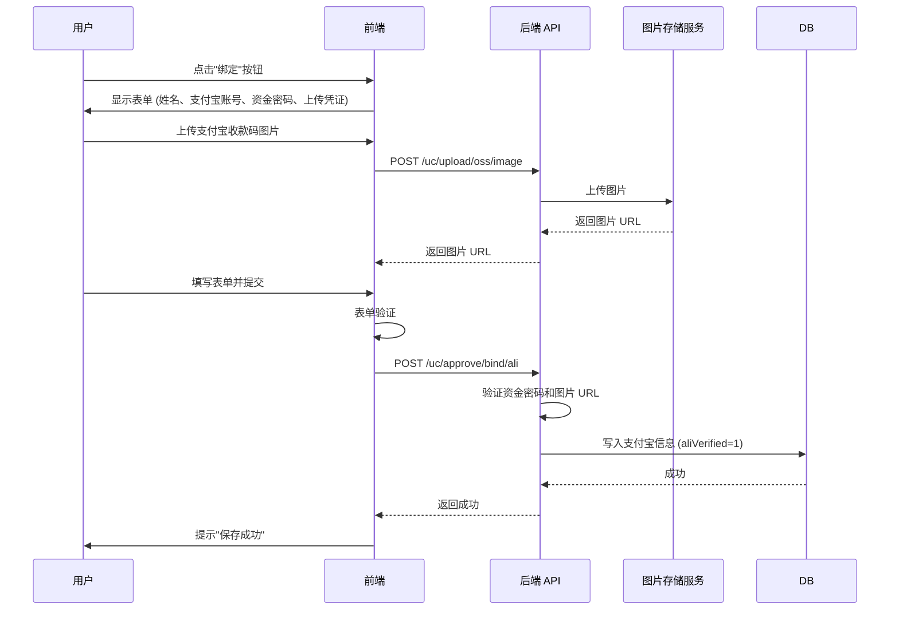
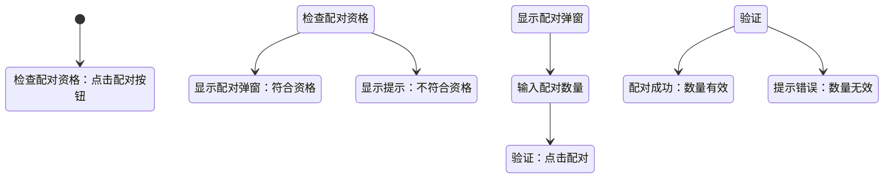
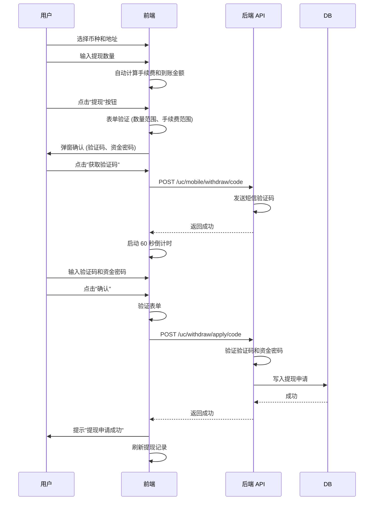

# 用户中心 (UC) 业务流程梳理

## 一、模块概述

用户中心（User Center，简称 UC）是 MSCOIN 平台的核心用户管理模块，提供账户安全、资产管理、交易记录、活动参与等全方位用户服务。

**访问地址**: `http://localhost:3000/#/uc` (默认跳转至 `/uc/safe` 安全中心)

---

## 二、整体架构

### 2.1 一级模块结构

```
用户中心 (/uc)
├── 1. 账户模块
│   ├── 安全设置 (/uc/safe)
│   └── 账户设置 (/uc/account)
│
├── 2. 资产模块
│   ├── 个人资产 (/uc/money)
│   ├── 合约资产 (/uc/contract-money)
│   ├── 账单明细 (/uc/record)
│   ├── 合约账单明细 (/uc/contract-record)
│   ├── 充值 (/uc/recharge)
│   └── 提现 (/uc/withdraw)
│
├── 3. 交易所模块 (币币交易)
│   ├── 当前委托 (/uc/entrust/current)
│   └── 历史委托 (/uc/entrust/history)
│
├── 4. 永续合约模块
│   ├── 当前委托 (/uc/contract/entrust/current)
│   └── 历史委托 (/uc/contract/entrust/history)
│
├── 5. OTC 模块
│   ├── 商家认证 (/uc/ident/business)
│   ├── 我的广告 (/uc/ad)
│   └── 我的订单 (/uc/order)
│
├── 6. 活动中心模块
│   ├── 我的订单 (/uc/innovation/myorders)
│   └── 我的挖矿 (/uc/innovation/myminings)
│
└── 7. 众筹模块
    └── 众筹列表 (/uc/crowdfunding/list)
```

### 2.2 技术架构

**前端框架**: Vue 3 + Vite + Element Plus
**状态管理**: Vuex 3.x (兼容模式)
**路由配置**: `src/config/routes-vue3.js`
**API 配置**: `src/config/api.js`
**主容器组件**: `src/pages-vue3/uc/MemberCenter.vue`

---

## 三、详细业务流程

### 3.1 账户模块

#### 3.1.1 安全设置 (`/uc/safe`)

**页面文件**: `src/pages-vue3/uc/Safe.vue`
**后端接口**: `/uc/approve/security/setting`

##### 功能列表

| 功能 | 状态显示 | 操作 | API 接口 |
|------|---------|------|---------|
| 实名认证 | 已认证/审核中/未认证/审核未通过 | 提交实名信息 | `/uc/approve/real/name` |
| 手机号绑定 | 已绑定/未绑定 | 绑定手机号 | `/uc/approve/bind/phone` |
| 登录密码 | - | 修改登录密码 | `/uc/approve/update/password` |
| 资金密码 | 已设置/未设置 | 设置/修改/找回 | `/uc/approve/transaction/password` |

##### 实名认证流程



**表单验证规则**:
- 真实姓名：必填
- 身份证号：必填
- 身份证正面照：必须上传
- 身份证反面照：必须上传
- 手持身份证照：必须上传
- 照片大小限制：≤8MB

**状态流转**:
```
未认证 → 提交申请 → 审核中 → 审核通过/审核未通过
realVerified=0    realAuditing=1    realVerified=1/0
                                    realNameRejectReason=null/原因
```

##### 手机号绑定流程



**表单验证规则**:
- 手机号：必填
- 登录密码：必填，至少 6 位
- 验证码：必填
- 验证码有效期：60 秒倒计时

##### 登录密码修改流程



**安全策略**:
- 必须先绑定手机号才能修改登录密码
- 修改成功后强制退出，需要重新登录

##### 资金密码管理流程

**三种场景**:

1. **首次设置** (fundsVerified=0):
   - 表单：资金密码、确认密码
   - API: `/uc/approve/transaction/password`

2. **修改密码** (fundsVerified=1):
   - 表单：旧资金密码、新资金密码、确认新密码
   - API: `/uc/approve/update/transaction/password`

3. **找回密码** (fundsVerified=1, 点击"忘记密码"):
   - 表单：新资金密码、确认密码、短信验证码
   - API: `/uc/approve/reset/transaction/password`



**安全等级显示逻辑**:
```javascript
if (realVerified==0 && phoneVerified==0 && fundsVerified==0) {
  显示"安全等级低"
} else if (realVerified==1 && phoneVerified==1 && fundsVerified==1) {
  显示"安全等级高"
} else {
  显示"安全等级中"
}
```

---

#### 3.1.2 账户设置 (`/uc/account`)

**页面文件**: `src/pages-vue3/uc/Account.vue`
**后端接口**: `/uc/approve/account/setting`

##### 功能列表

| 功能 | 状态显示 | 操作 | API 接口 |
|------|---------|------|---------|
| 银行卡 | 已绑定/未绑定 | 绑定/修改 | `/uc/approve/bind/bank` `/uc/approve/update/bank` |
| 支付宝 | 已绑定/未绑定 | 绑定/修改 | `/uc/approve/bind/ali` `/uc/approve/update/ali` |
| 微信支付 | 已绑定/未绑定 | 绑定/修改 | `/uc/approve/bind/wechat` `/uc/approve/update/wechat` |

##### 银行卡绑定流程



**表单验证规则**:
- 真实姓名：必填， disabled (自动填充实名认证姓名)
- 开户银行：必填，从 29 家银行列表选择
- 支行名称：必填
- 银行卡号：必填，6-18 位数字
- 确认卡号：必填，必须与卡号一致
- 资金密码：必填，至少 6 位

**支持的银行** (29 家):
中国工商银行、中国农业银行、中国建设银行、中国邮政储蓄银行、招商银行、中国银行、交通银行、中信银行、华夏银行、中国民生银行、广发银行、平安银行、兴业银行、上海浦东发展银行、浙商银行、渤海银行、恒丰银行、花旗银行、渣打银行、汇丰银行、中国光大银行、上海银行、江苏银行、重庆银行、天津银行、厦门银行、城市商业银行、农村商业银行、徽商银行

##### 支付宝绑定流程

**特殊要求**: 需要上传支付宝收款码截图



##### 微信支付绑定流程

与支付宝类似，需要上传微信收款码截图。

---

### 3.2 资产模块

#### 3.2.1 个人资产 (`/uc/money`)

**页面文件**: `src/pages-vue3/uc/MoneyIndex.vue`
**后端接口**: `/uc/asset/wallet`

##### 功能列表

| 功能 | 说明 | 计算公式 |
|------|------|---------|
| 资产总览 | 显示所有币种的 USDT 和 CNY 估值 | `∑(余额 + 冻结) × 汇率` |
| 币种列表 | 币种、可用余额、冻结余额、待释放、操作 | - |
| 充值 | 跳转到充值页面 | `goRecharge(unit)` |
| 提现 | 跳转到提现页面 | `goWithdraw(unit)` |
| 配对 | GCC 配对功能 | `/uc/asset/wallet/match` |

##### 资产总览计算

```javascript
// USDT 总估值
const totalUSDT = computed(() => {
  let usdtTotal = 0
  for (let i = 0; i < tableMoney.value.length; i++) {
    usdtTotal += (tableMoney.value[i].balance + tableMoney.value[i].frozenBalance)
                 * tableMoney.value[i].coin.usdRate
  }
  return usdtTotal.toFixed(2)
})

// CNY 总估值
const totalCny = computed(() => {
  let cnyTotal = 0
  for (let i = 0; i < tableMoney.value.length; i++) {
    cnyTotal += (tableMoney.value[i].balance + tableMoney.value[i].frozenBalance)
                * tableMoney.value[i].coin.cnyRate
  }
  return cnyTotal.toFixed(2)
})
```

##### 充值按钮状态

```javascript
const canCharge = (row) => {
  return row.coin.canRecharge === 1 &&
         ((row.address != null && row.address !== '') || row.coin.accountType === 1)
}
```

**条件**:
- 币种允许充值 (`canRecharge=1`)
- 已生成充值地址 或 币种为账户类型 (如 XRP 需要 Memo)

##### GCC 配对功能



---

#### 3.2.2 充值 (`/uc/recharge`)

**页面文件**: `src/pages-vue3/uc/Recharge.vue`
**后端接口**:
- `/uc/approve/wallet/coin/list` - 获取币种列表
- `/uc/asset/transaction/all` - 充值记录

##### 功能列表

| 功能 | 说明 |
|------|------|
| 币种选择 | 下拉选择要充值的币种 |
| 充值地址显示 | 显示当前币种的充值地址 |
| 地址复制 | 一键复制充值地址 |
| 二维码显示 | 弹窗显示地址二维码 |
| Memo 显示 | 对于需要 Memo 的币种 (如 XRP) |
| 获取地址 | 如地址为空，可手动获取 |
| 充值记录 | 显示历史充值记录 |

##### 账户类型币种处理

对于 `accountType=1` 的币种 (如 XRP、EOS):
- 需要显示充值地址 + Memo
- 地址格式：`depositAddress` 字段
- Memo 用于区分不同用户的入账

##### 充值记录查询

```javascript
const getList = (pageN) => {
  const params = {
    memberId,    // 用户 ID
    pageNo,      // 页码
    pageSize,    // 每页数量 (10)
    type         // 类型 (0=充值)
  }
  axios.post(`${host}/uc/asset/transaction/all`, params)
}
```

---

#### 3.2.3 提现 (`/uc/withdraw`)

**页面文件**: `src/pages-vue3/uc/Withdraw.vue`
**后端接口**:
- `/uc/withdraw/support/coin/info` - 支持的提现币种
- `/uc/withdraw/apply/code` - 提交提现申请
- `/uc/withdraw/record` - 提现记录
- `/uc/mobile/withdraw/code` - 获取提现验证码

##### 功能列表

| 功能 | 说明 |
|------|------|
| 币种选择 | 下拉选择要提现的币种 |
| 地址选择 | 从已保存地址中选择 |
| 提现数量 | 输入提现数量 (带精度验证) |
| 手续费计算 | 自动计算手续费 |
| 到账金额 | 自动计算 (提现数量 - 手续费) |
| 提现记录 | 显示历史提现记录和状态 |

##### 提现流程



##### 提现验证规则

```javascript
const valid = () => {
  // 1. 币种验证
  if (coinType.value === '') { error("请选择币种") }

  // 2. 地址验证
  if (!withdrawAddress.value) { error("请选择地址") }

  // 3. 数量验证 (≥最小提现数量)
  if (!withdrawAmount.value || withdrawAmount.value < currentCoin.minAmount) {
    error("小于最小提现数量")
  }

  // 4. 手续费验证
  if (withdrawAmount.value < withdrawFee.value) {
    error("提现数量小于手续费")
  }

  // 5. 手续费范围验证
  if (!withdrawFee.value || withdrawFee.value > currentCoin.maxTxFee ||
      withdrawFee.value < currentCoin.minTxFee) {
    error("手续费超出范围")
  }
}
```

##### 提现状态

| 状态码 | 显示文本 |
|--------|---------|
| 0 | 审核中 |
| 1 | 打款中 |
| 2 | 打款成功 |
| 3 | 打款失败 |

---

#### 3.2.4 账单明细 (`/uc/record`)

**页面文件**: `src/pages-vue3/uc/Record.vue`
**后端接口**: `/uc/asset/transaction/all`

##### 功能列表

| 功能 | 说明 |
|------|------|
| 账单类型筛选 | 全部/充值/提现/转账/交易等 |
| 币种筛选 | 按币种过滤 |
| 时间范围 | 显示账单时间 |
| 分页 | 每页 10 条记录 |

---

#### 3.2.5 合约资产 (`/uc/contract-money`)

**页面文件**: `src/pages-vue3/uc/ContractMoneyIndex.vue`
**后端接口**: `/uc/asset/contract-wallet/`

##### 功能列表

| 功能 | 说明 |
|------|------|
| 合约资产总览 | 显示合约账户总资产 |
| 币种列表 | 币种、可用余额、冻结余额 |
| 划转 | 法币账户 ↔ 合约账户 |

---

#### 3.2.6 合约账单明细 (`/uc/contract-record`)

**页面文件**: `src/pages-vue3/uc/ContractRecord.vue`
**后端接口**: `/uc/asset/transaction/all` (type=合约)

---

### 3.3 交易所模块 (币币交易)

#### 3.3.1 当前委托 (`/uc/entrust/current`)

**页面文件**: `src/pages-vue3/uc/EntrustCurrent.vue`
**后端接口**: `/exchange/order/current`

##### 功能列表

| 功能 | 说明 |
|------|------|
| 当前委托列表 | 显示未成交的委托单 |
| 委托详情 | 交易对、方向、价格、数量、成交额 |
| 撤单 | 取消未成交的委托 |

---

#### 3.3.2 历史委托 (`/uc/entrust/history`)

**页面文件**: `src/pages-vue3/uc/EntrustHistory.vue`
**后端接口**: `/exchange/order/history`

##### 功能列表

| 功能 | 说明 |
|------|------|
| 历史委托列表 | 显示已成交/已撤销的委托单 |
| 委托详情 | 完整的委托信息 |

---

### 3.4 永续合约模块

#### 3.4.1 当前委托 (`/uc/contract/entrust/current`)

**页面文件**: `src/pages-vue3/uc/contract/EntrustCurrent.vue`
**后端接口**: `/swap/order-entrust/current`

---

#### 3.4.2 历史委托 (`/uc/contract/entrust/history`)

**页面文件**: `src/pages-vue3/uc/contract/EntrustHistory.vue`
**后端接口**: `/swap/order-entrust/history`

---

### 3.5 OTC 模块

#### 3.5.1 商家认证 (`/uc/ident/business`)

**页面文件**: `src/pages-vue3/uc/IdentBusiness.vue`
**后端接口**:
- `/uc/approve/certified/business/status` - 查询认证状态
- `/uc/approve/certified/business/apply` - 提交认证申请

##### 功能列表

| 功能 | 说明 |
|------|------|
| 认证状态查询 | 显示当前认证商家状态 |
| 提交认证申请 | 填写商家信息并提交 |

---

#### 3.5.2 我的广告 (`/uc/ad`)

**页面文件**: `src/pages-vue3/otc/MyAd.vue`
**后端接口**: `/otc/advertise/page-by-unit`

##### 功能列表

| 功能 | 说明 |
|------|------|
| 广告列表 | 显示用户发布的 OTC 广告 |
| 创建广告 | 跳转到广告发布页面 |
| 编辑广告 | 修改已有广告 |
| 上架/下架 | 控制广告状态 |

---

#### 3.5.3 我的订单 (`/uc/order`)

**页面文件**: `src/pages-vue3/uc/myorder.vue`

##### 功能列表

| 功能 | 说明 |
|------|------|
| 订单列表 | OTC 交易订单历史 |
| 订单详情 | 订单完整信息 |

---

### 3.6 活动中心模块

#### 3.6.1 我的订单 (`/uc/innovation/myorders`)

**页面文件**: `src/pages-vue3/uc/InnovationOrders.vue`
**后端接口**: `/uc/activity/getmyorders`

---

#### 3.6.2 我的挖矿 (`/uc/innovation/myminings`)

**页面文件**: `src/pages-vue3/uc/InnovationMinings.vue`
**后端接口**: `/uc/miningorder/my-minings`

---

### 3.7 众筹模块

#### 3.7.1 众筹列表 (`/uc/crowdfunding/list`)

**页面文件**: `src/pages-vue3/uc/crowdfunding-list.vue`
**后端接口**:
- `/crowd/funding/getMemberMedicalFunding` - 医疗众筹
- `/crowd/funding/getMemberFunding` - 其他众筹
- `/crowd/funding/getMemberWelfare` - 线下公益
- `/crowd/funding/getFundingRecord` - 我的捐款

---

## 四、API 接口汇总

### 4.1 安全认证类

| 接口路径 | 方法 | 说明 |
|---------|------|------|
| `/uc/approve/security/setting` | POST | 获取安全设置信息 |
| `/uc/approve/real/name` | POST | 提交实名认证 |
| `/uc/approve/bind/phone` | POST | 绑定手机号 |
| `/uc/approve/update/password` | POST | 修改登录密码 |
| `/uc/approve/transaction/password` | POST | 设置资金密码 |
| `/uc/approve/update/transaction/password` | POST | 修改资金密码 |
| `/uc/approve/reset/transaction/password` | POST | 找回资金密码 |

### 4.2 账户设置类

| 接口路径 | 方法 | 说明 |
|---------|------|------|
| `/uc/approve/account/setting` | POST | 获取账户设置信息 |
| `/uc/approve/bind/bank` | POST | 绑定银行卡 |
| `/uc/approve/update/bank` | POST | 修改银行卡 |
| `/uc/approve/bind/ali` | POST | 绑定支付宝 |
| `/uc/approve/update/ali` | POST | 修改支付宝 |
| `/uc/approve/bind/wechat` | POST | 绑定微信 |
| `/uc/approve/update/wechat` | POST | 修改微信 |

### 4.3 资产管理类

| 接口路径 | 方法 | 说明 |
|---------|------|------|
| `/uc/asset/wallet` | POST | 获取个人资产 |
| `/uc/asset/contract-wallet/` | POST | 获取合约资产 |
| `/uc/asset/transaction/all` | POST | 获取账单明细 |
| `/uc/asset/wallet/reset-address` | POST | 重置充值地址 |
| `/uc/asset/wallet/match-check` | POST | 检查配对资格 |
| `/uc/asset/wallet/match` | POST | 执行配对 |

### 4.4 充值提现类

| 接口路径 | 方法 | 说明 |
|---------|------|------|
| `/uc/approve/wallet/coin/list` | POST | 获取充值币种列表 |
| `/uc/withdraw/support/coin/info` | POST | 获取提现币种信息 |
| `/uc/withdraw/apply/code` | POST | 提交提现申请 |
| `/uc/withdraw/record` | POST | 获取提现记录 |
| `/uc/mobile/withdraw/code` | POST | 获取提现验证码 |

### 4.5 图片上传

| 接口路径 | 方法 | 说明 |
|---------|------|------|
| `/uc/upload/oss/image` | POST | 上传 OSS 图片 |

---

## 五、前端 UI 实现差异分析

### 5.1 整体布局

** MemberCenter.vue 布局结构**:
```
┌─────────────────────────────────────────┐
│  左侧菜单 (20%)  │  右侧内容区 (80%)      │
│  - 账户          │                       │
│  - 资产          │  路由视图              │
│  - 交易所        │  (router-view)        │
│  - 永续合约      │                       │
│  - OTC          │                       │
│  - 活动中心      │                       │
│  - 众筹          │                       │
└─────────────────────────────────────────┘
```

### 5.2 安全中心页面 (Safe.vue)

**UI 结构**:
```
┌─────────────────────────────────────────┐
│  用户信息区                               │
│  - 头像 (V 等级)  │  安全等级显示          │
├─────────────────────────────────────────┤
│  安全卡片列表                            │
│  ┌─────────────────────────────────┐    │
│  │ [图标] 实名认证  │ 状态 │ 操作  │    │
│  ├─────────────────────────────────┤    │
│  │ [图标] 手机号    │ 状态 │ 操作  │    │
│  ├─────────────────────────────────┤    │
│  │ [图标] 登录密码  │ 状态 │ 操作  │    │
│  ├─────────────────────────────────┤    │
│  │ [图标] 资金密码  │ 状态 │ 操作  │    │
│  └─────────────────────────────────┘    │
└─────────────────────────────────────────┘
```

**交互特点**:
- 点击"未认证"/"绑定"/"设置"等按钮展开表单
- 表单默认隐藏，点击后显示 (`choseItem` 控制)
- 实名认证表单最复杂 (含 3 个图片上传)
- 修改登录密码后自动跳转登录页

### 5.3 账户设置页面 (Account.vue)

**UI 结构**:
```
┌─────────────────────────────────────────┐
│  提示条：账户设置 | 绑定收款方式，用于提现   │
├─────────────────────────────────────────┤
│  收款方式卡片                            │
│  ┌─────────────────────────────────┐    │
│  │ 银行卡  │ 状态 │ 操作          │    │
│  ├─────────────────────────────────┤    │
│  │ 支付宝  │ 状态 │ 操作          │    │
│  ├─────────────────────────────────┤    │
│  │ 微信支付│ 状态 │ 操作          │    │
│  └─────────────────────────────────┘    │
└─────────────────────────────────────────┘
```

**特殊 UI**:
- 支付宝/微信需要上传凭证图片 (200x200)
- 银行卡有 29 家银行下拉选择
- 银行卡号需要二次确认

### 5.4 充值页面 (Recharge.vue)

**UI 结构**:
```
┌─────────────────────────────────────────┐
│  币种选择 │ 充值地址 │ 复制/二维码       │
│  Memo 显示 (如需要)                       │
├─────────────────────────────────────────┤
│  充值说明                                │
│  - 最小充值数量                          │
│  - 网络确认说明                          │
├─────────────────────────────────────────┤
│  充值记录表格                            │
│  时间 | 币种 | 地址 | 数量 | 状态       │
└─────────────────────────────────────────┘
```

### 5.5 提现页面 (Withdraw.vue)

**UI 结构**:
```
┌─────────────────────────────────────────┐
│  [右上角] 提现地址管理 →                 │
├─────────────────────────────────────────┤
│  币种选择 │ 地址选择 (下拉)              │
├─────────────────────────────────────────┤
│  提现数量 │ 可用余额 │ 自动计算手续费    │
│  到账金额 (数量 - 手续费)                 │
├─────────────────────────────────────────┤
│  [提现按钮]                              │
├─────────────────────────────────────────┤
│  提现说明                                │
├─────────────────────────────────────────┤
│  提现记录表格 (带状态筛选)               │
└─────────────────────────────────────────┘
```

**弹窗确认**:
- 提现需要二次确认弹窗
- 输入短信验证码 + 资金密码

---

## 六、登录态管理

### 6.1 登录检查

```javascript
// MemberCenter.vue onMounted
if (!hasAuthenticatedSession({ storage: localStorage, store })) {
  router.replace({
    path: '/login',
    query: { returnUrl: router.currentRoute.value.fullPath }
  })
  return
}
```

### 6.2 用户信息存储

```javascript
// store-vue3.js
state: {
  member: null,  // 用户信息对象
}
getters: {
  isLogin: state => state.member != null
}
```

### 6.3 Token 管理

```javascript
// 请求头携带
headers: {
  'x-auth-token': localStorage.getItem('TOKEN')
}

// 退出登录
store.commit('removeMember')
localStorage.removeItem('TOKEN')
```

---

## 七、国际化支持

页面使用 `vue-i18n` 进行国际化，文本通过 `$t()` 函数获取。

**示例**:
```javascript
{{ $t('uc.finance.recharge.symbol') }}
{{ $t('uc.finance.withdraw.address') }}
```

---

## 八、响应式设计

**移动端适配** (≤768px):
- 左侧菜单隐藏，显示汉堡菜单按钮
- 点击菜单按钮显示抽屉式导航
- 内容区宽度自适应

```css
@media screen and (max-width: 768px) {
  .pc_menu {
    display: none !important;
  }
  .header_nav_mobile_triggle {
    display: block !important;
  }
}
```

---

## 九、关键数据流

```
用户操作 → 前端表单验证 → API 请求 → 后端处理 → 数据库写入 → 返回结果 → 前端提示 → 刷新状态
                              ↓
                         (需要验证码的先获取验证码)
                              ↓
                         60 秒倒计时限制
```

---

## 十、安全策略汇总

| 场景 | 安全措施 |
|------|---------|
| 修改登录密码 | 需要手机验证码 + 旧密码，成功后强制重新登录 |
| 设置资金密码 | 仅需资金密码 |
| 修改资金密码 | 需要旧资金密码 |
| 找回资金密码 | 需要手机验证码 |
| 绑定收款方式 | 需要资金密码 |
| 提现 | 需要短信验证码 + 资金密码 |
| 图片上传 | 大小限制 8MB |
| 会话管理 | localStorage 存储 TOKEN，过期自动退出 |

---

## 十一、待补充页面

以下页面未详细分析，建议后续补充:

1. **账单明细** (`Record.vue`)
2. **合约资产** (`ContractMoneyIndex.vue`)
3. **合约账单** (`ContractRecord.vue`)
4. **当前委托** (`EntrustCurrent.vue`, `contract/EntrustCurrent.vue`)
5. **历史委托** (`EntrustHistory.vue`, `contract/EntrustHistory.vue`)
6. **商家认证** (`IdentBusiness.vue`)
7. **我的广告** (`OtcMyAd.vue`)
8. **我的订单** (`myorder.vue`)
9. **活动订单** (`InnovationOrders.vue`)
10. **我的挖矿** (`InnovationMinings.vue`)
11. **众筹列表** (`crowdfunding-list.vue`)
