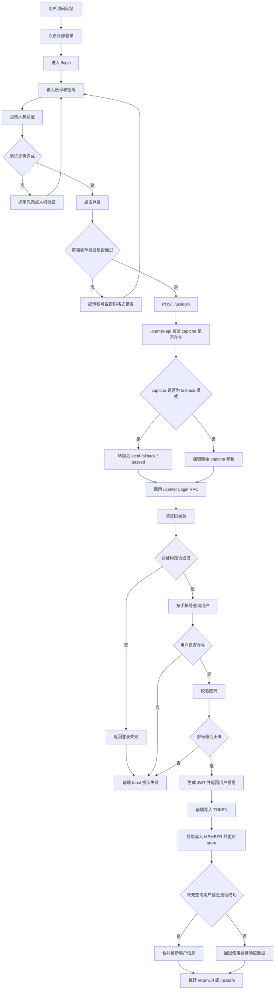
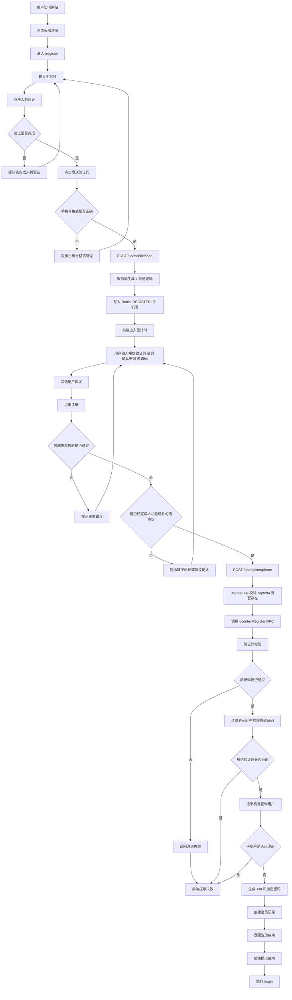

# 用户登录注册流程梳理

## 一、登录

### 1. 用户操作步骤

1. 用户访问网站首页。
2. 在页面头部点击“登录”，进入 `/login`。
3. 输入账号。
   当前页面文案展示为“手机号或邮箱”，但后端实际按手机号登录处理。
4. 输入密码。
5. 点击“人机验证”按钮，完成本地 fallback 验证。
6. 点击“登录”按钮提交表单。
7. 登录成功后，前端保存登录态并跳转到目标页。
   默认跳转到 `/uc/safe`，如果登录页带有 `returnUrl`，则跳回原目标页。

### 2. 业务逻辑说明

前端登录页先做基础校验：账号不能为空、密码不能为空且长度至少 6 位、人机验证必须先完成。校验通过后，前端向 `POST /uc/login` 提交账号、密码和 fallback captcha 标记。

`ucenter-api` 收到请求后，先校验请求体里是否带 captcha，再把前端的 fallback 协议转换成 RPC 能识别的内部验证码参数，然后调用 `ucenter` 的登录 RPC。

RPC 层按以下顺序处理：先校验验证码，再按手机号查询用户，再用数据库中的 `salt + password` 校验密码。只要密码正确，就生成 JWT，并返回用户基础信息与 token。

前端拿到成功响应后，会先建立本地 session：写入 `TOKEN`，写入 `MEMBER`，并同步更新 Vuex 中的 `member`。如果补充查询用户详情接口失败，则回退使用登录接口本身返回的数据，不中断登录。登录态建立完成后，页面才跳转到用户中心或原始受保护页面。

应用启动和路由切换时，前端会先尝试从 `localStorage` 恢复 `MEMBER`，并在进入 `/uc` 开头的受保护路由前校验当前是否已有有效登录态；如果没有，就重定向回登录页。

### 3. 登录流程图

## 二、注册

### 1. 用户操作步骤

1. 用户访问网站首页。
2. 在页面头部点击“注册”，进入 `/register`。
3. 输入手机号。
4. 点击“人机验证”按钮，完成本地 fallback 验证。
5. 点击“发送验证码”。
6. 输入收到的短信验证码。
7. 输入密码。
8. 输入确认密码。
9. 选填邀请码。
10. 勾选用户协议。
11. 点击“注册”提交表单。
12. 注册成功后，页面提示成功，并跳转到 `/login`。

### 2. 业务逻辑说明

前端注册页先做表单校验：手机号必填且必须符合手机号格式，短信验证码必填，密码必填且至少 6 位，确认密码必须与密码一致；同时要求用户先完成人机验证并勾选用户协议。

发送短信验证码时，前端调用 `POST /uc/mobile/code`，传手机号和国家信息。服务端会生成 4 位验证码，写入 Redis，键格式为 `REGISTER::<phone>`，并设置过期时间。当前代码里发送短信更接近“生成并缓存验证码”的本地开发链路。

服务端之所以把验证码存到 Redis，而不是只放在当前请求里，是因为“发送验证码”和“提交注册”是两个独立请求。用户先点击发送验证码，几秒或几十秒后才会提交注册表单，服务端必须把这个验证码临时保存起来，等第二次注册请求到达时再取出比对。Redis 适合这种短期、可过期、按手机号快速读取的临时数据场景，所以当前实现把验证码写成 `REGISTER::<phone>`，并设置 5 分钟过期时间。

真正注册时，前端调用 `POST /uc/register/phone`，提交手机号、用户名、密码、邀请码、短信验证码、国家信息和 captcha。`ucenter-api` 收到请求后先检查 captcha 是否存在，再转发给 `ucenter` 注册 RPC。

RPC 层按以下顺序处理：先校验验证码，再从 Redis 读取短信验证码并比对，然后检查手机号是否已注册；如果手机号未注册，就生成盐值和加密密码，创建会员记录并写入数据库。这里的密码不是直接明文入库，当前后端使用 `PBKDF2 + SHA512` 做密码派生：先生成随机盐值 `salt`，再用“原始密码 + salt”作为输入，通过 `pbkdf2.Key` 按固定迭代次数和固定长度生成最终密文，数据库里分别保存 `salt` 和加密后的 `password`。后续登录时，不会反推原密码，而是取出数据库中的 `salt`，用用户本次输入的密码按同样算法重新计算一次，再与库里的密文比较是否一致。

需要注意，当前注册链路虽然页面流程完整，但它对 fallback captcha 的兼容逻辑没有像登录那样在 API 层做显式转换；文档这里描述的是现有代码流程，不代表它已经和登录一样完全稳定。

### 3. 注册流程图

