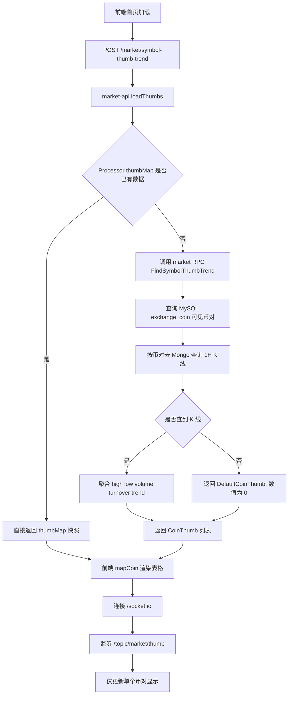
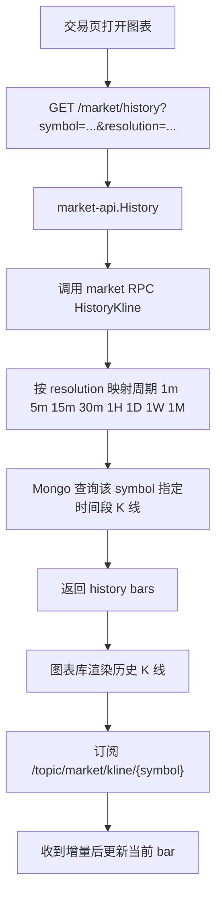

# 行情数据对接实现方案

## 1. 文档目标

本文档基于当前仓库实现和外部笔记 [03.md](D:/Download/001%20Go交易所/资料/笔记-正常/03-行情数据/03.md) 梳理行情数据链路，目标是讲清楚三件事：

- 行情业务在系统里是如何跑通的。
- 各服务之间是如何对接的，数据从哪里来，经过哪些系统，最终如何展示到页面上。
- 这条链路里是否包含 Web2 系统调用区块链数据的场景，以及它和行情主链路的关系。

本文不按理想方案推演，结论以当前代码真实实现为准。

## 2. 业务目标

当前系统里的“行情数据”至少服务两类前端场景：

- 首页行情列表
  - 展示币对列表、最新价、涨跌幅、最高价、最低价、24h 成交量、趋势。
- 交易页 / K 线图
  - 展示某个交易对的历史 K 线。
  - 在页面打开后继续接收实时更新。

对应前端入口：

- 首页列表页：[Index.vue](E:/Project/web3/mscoin/mscoin-frontend/src/pages-vue3/index/Index.vue)
- 交易图表数据源：[bitrade.js](E:/Project/web3/mscoin/mscoin-frontend/src/assets/js/charting_library/datafeed/bitrade.js)

## 3. 当前架构中的角色划分

### 3.1 上游数据源

当前代码和 `03.md` 都指向 OKX 作为行情上游：

- K 线来源：`GET /api/v5/market/candles`
- 汇率来源：`GET /api/v5/market/exchange-rate`

当前配置位置：

- [jobcenter/etc/conf.yaml](E:/Project/web3/mscoin/mscoin-backend/jobcenter/etc/conf.yaml)

### 3.2 系统内角色

- `jobcenter`
  - 定时从 OKX 拉 K 线和汇率。
  - 写 Mongo。
  - 将 1 分钟 K 线增量推送到 Kafka。
- `market`
  - 从 MySQL 读取可见交易对。
  - 从 Mongo 聚合 K 线，生成首页需要的 `CoinThumb`。
  - 提供 gRPC 给 `market-api`。
- `market-api`
  - 对外暴露 HTTP 接口，例如 `/market/symbol-thumb-trend`、`/market/history`。
  - 启动时订阅 Kafka。
  - 通过 Socket.IO 向前端广播实时行情。
- `frontend`
  - 首页先请求一次快照，再通过 WebSocket 增量更新。
  - K 线图先请求历史数据，再通过 WebSocket 收增量数据。

### 3.3 存储与中间件

- MySQL
  - 存交易对基础信息，例如 `exchange_coin`。
- MongoDB
  - 存多周期 K 线。
- Redis / go-zero cache
  - 存最新价格、汇率等快速读取数据。
- Kafka
  - 在 `jobcenter` 和 `market-api` 之间传递 1 分钟 K 线增量。

## 4. 行情数据的来源和类型

### 4.1 K 线数据

`03.md` 的主思路是定时拉取 OKX K 线，然后存 Mongo。当前代码已落地到：

- [jobcenter/internal/logic/kline.go](E:/Project/web3/mscoin/mscoin-backend/jobcenter/internal/logic/kline.go)
- [jobcenter/internal/task/task.go](E:/Project/web3/mscoin/mscoin-backend/jobcenter/internal/task/task.go)

当前周期包括：

- `1m`
- `3m`
- `5m`
- `15m`
- `30m`
- `1H`
- `2H`
- `4H`
- `1D`
- `1W`
- `1M`

### 4.2 汇率数据

汇率由 `jobcenter` 定时从 OKX 拉取：

- [jobcenter/internal/logic/rate.go](E:/Project/web3/mscoin/mscoin-backend/jobcenter/internal/logic/rate.go)

当前代码会把 `usdCny` 写入缓存键：

- `USDT::CNY::RATE`

### 4.3 页面使用的数据形态

后端并不是把 OKX 原始返回直接给前端，而是聚合成业务字段：

- `symbol`
- `open`
- `high`
- `low`
- `close`
- `volume`
- `turnover`
- `lastDayClose`
- `usdRate`
- `baseUsdRate`
- `trend`

字段定义见：

- [market/api/market.proto](E:/Project/web3/mscoin/mscoin-backend/market/api/market.proto)

## 5. 首页行情列表是如何跑通的

### 5.1 业务主链路

首页使用的是“快照 + 推送”的模式：

1. 页面加载后，前端调用 `/market/symbol-thumb-trend` 获取当前所有可见交易对的行情快照。
2. `market-api` 优先从内存中的 `thumbMap` 取数据。
3. 如果内存里还没有，就调用 `market` gRPC 的 `FindSymbolThumbTrend`。
4. `market` 从 MySQL 取可见币对列表，再去 Mongo 查对应交易对的 `1H` K 线数据。
5. `market` 将 Mongo 的 K 线聚合成首页展示需要的 `CoinThumb` 列表。
6. 前端拿到列表后映射为页面字段，渲染表格。
7. 页面再连接 `/socket.io`，监听 `/topic/market/thumb`，收到推送后只更新变动币对。

### 5.2 关键代码位置

前端首页：

- 拉快照：[Index.vue](E:/Project/web3/mscoin/mscoin-frontend/src/pages-vue3/index/Index.vue)
- WebSocket 订阅：[Index.vue](E:/Project/web3/mscoin/mscoin-frontend/src/pages-vue3/index/Index.vue)

HTTP 暴露：

- 路由注册：[routes_handler.go](E:/Project/web3/mscoin/mscoin-backend/market-api/internal/handler/routes_handler.go)
- 处理器：[market.go](E:/Project/web3/mscoin/mscoin-backend/market-api/internal/handler/market.go)
- HTTP 逻辑：[market_logic.go](E:/Project/web3/mscoin/mscoin-backend/market-api/internal/logic/market_logic.go)

RPC 聚合：

- RPC 入口：[market/internal/logic/market_logic.go](E:/Project/web3/mscoin/mscoin-backend/market/internal/logic/market_logic.go)
- 聚合实现：[markert_domain.go](E:/Project/web3/mscoin/mscoin-backend/market/internal/domain/markert_domain.go)
- Mongo 查询：[market/internal/dao/kline.go](E:/Project/web3/mscoin/mscoin-backend/market/internal/dao/kline.go)

### 5.3 首页为什么会显示 0

当前代码里，如果 `market` 没有查到对应交易对的 K 线数据，会返回默认空行情：

- [market/internal/domain/markert_domain.go](E:/Project/web3/mscoin/mscoin-backend/market/internal/domain/markert_domain.go)
- [market/internal/model/kline.go](E:/Project/web3/mscoin/mscoin-backend/market/internal/model/kline.go)

所以首页显示 `0` 的根因通常不在前端，而在以下任一环节：

- `jobcenter` 没有成功从 OKX 拉到 K 线。
- 拉到了，但没有正确写入 Mongo。
- `market` 查询的 Mongo 集合里没有该交易对 / 周期的数据。
- `exchange_coin` 里可见币对和 Mongo 中的 symbol 对不上。

### 5.4 首页行情流程图

## 6. 交易页 K 线图是如何跑通的

### 6.1 业务主链路

交易页 K 线图走的是另一条链路：

1. 图表初始化时，前端通过 `/history` 拉指定交易对、指定周期、指定时间范围的历史 K 线。
2. `market-api` 调用 `market` 的 `HistoryKline` RPC。
3. `market` 根据 `resolution` 选择对应周期，例如 `1` 对应 `1m`，`60` 对应 `1H`。
4. `market` 到 Mongo 查询该交易对在这个周期内的历史 K 线。
5. 查询结果返回给前端图表库。
6. 图表随后监听 `/topic/market/kline/{symbol}` 接收实时增量。

### 6.2 关键代码位置

前端图表数据源：

- [bitrade.js](E:/Project/web3/mscoin/mscoin-frontend/src/assets/js/charting_library/datafeed/bitrade.js)

后端接口：

- 路由：[routes_handler.go](E:/Project/web3/mscoin/mscoin-backend/market-api/internal/handler/routes_handler.go)
- Handler：[market.go](E:/Project/web3/mscoin/mscoin-backend/market-api/internal/handler/market.go)
- Logic：[market_logic.go](E:/Project/web3/mscoin/mscoin-backend/market-api/internal/logic/market_logic.go)
- RPC 实现：[market/internal/logic/market_logic.go](E:/Project/web3/mscoin/mscoin-backend/market/internal/logic/market_logic.go)

### 6.3 一个当前实现细节

当前前端图表数据源在实时订阅里只对 `resolution == "1"` 的 `/topic/market/kline/{symbol}` 做处理，也就是 1 分钟实时增量更直接；其他周期更多还是靠历史接口加载后展示。

### 6.4 K 线图流程图

## 7. 实时更新是如何打通的

### 7.1 数据进入 Kafka

`jobcenter` 每次拉取 `1m` K 线成功后，会做两件事：

- 存 Mongo
- 将最新一条 1 分钟 K 线发送到 Kafka `kline_1m`

位置：

- [jobcenter/internal/logic/kline.go](E:/Project/web3/mscoin/mscoin-backend/jobcenter/internal/logic/kline.go)
- [jobcenter/internal/domain/queueDomain.go](E:/Project/web3/mscoin/mscoin-backend/jobcenter/internal/domain/queueDomain.go)

### 7.2 market-api 消费 Kafka

`market-api` 启动时会初始化 `Processor`：

1. 创建 Kafka 客户端。
2. 初始化 `DefaultProcessor`。
3. 先从 `market` RPC 拉一份 `thumbMap` 作为初始快照。
4. 开始消费 `kline_1m`。
5. 把消息交给 `WebsocketHandler`。

位置：

- [service_context.go](E:/Project/web3/mscoin/mscoin-backend/market-api/internal/svc/service_context.go)
- [processor.go](E:/Project/web3/mscoin/mscoin-backend/market-api/internal/processor/processor.go)
- [wshandler.go](E:/Project/web3/mscoin/mscoin-backend/market-api/internal/processor/wshandler.go)

### 7.3 WebSocket 推给前端

当前 `market-api` 会广播：

- `/topic/market/thumb`
  - 首页和交易页都可用于更新最新价格快照。
- `/topic/market/kline/{symbol}`
  - 交易页 K 线图使用。
- `/topic/market/trade-plate/{symbol}`
  - 盘口区域使用。

## 8. 推荐的完整对接方案

结合当前代码和 `03.md`，如果要把行情链路真正跑稳，推荐按下面的分层方式实现。

### 8.1 上游接入层

由 `jobcenter` 统一对接 OKX，不让前端直接调第三方：

- K 线：OKX `candles`
- 汇率：OKX `exchange-rate`
- 如需更强实时性，再补 OKX `ticker/tickers` 或公共 WebSocket

原因：

- 便于统一字段口径
- 便于切换上游来源
- 便于缓存、限流、重试
- 前端不暴露第三方依赖细节

### 8.2 数据落地层

- K 线长期数据放 Mongo
- 最新价 / 汇率 / 快速读取字段放 Redis
- 币对元数据放 MySQL

这样做的目的：

- Mongo 适合按 symbol + period + time 查询 K 线
- Redis 适合最新价、汇率、页面快照
- MySQL 适合交易对配置和后台管理

### 8.3 聚合服务层

由 `market` 负责：

- 读 `exchange_coin`
- 读 Mongo K 线
- 拼出 `CoinThumb`
- 提供历史 K 线查询

这层应该只暴露业务语义，不暴露 OKX 原始协议。

### 8.4 实时推送层

由 `jobcenter -> Kafka -> market-api -> WebSocket` 完成：

- `jobcenter` 只负责生产消息
- `market-api` 负责消费并推送前端
- 前端只关心业务频道 `/topic/market/*`

### 8.5 前端展示层

建议继续维持两类消费方式：

- 列表页：快照接口 + `/topic/market/thumb`
- 图表页：历史接口 + `/topic/market/kline/{symbol}`

## 9. 是否包含 Web2 系统调用区块链数据的场景

**包含，但不在这条行情主链路里。**

当前仓库中确实存在“Web2 服务调用链上 / 节点数据”的实现，但它的业务目标不是行情，而是充值到账扫描。

对应实现：

- [jobcenter/internal/logic/bitcoin.go](E:/Project/web3/mscoin/mscoin-backend/jobcenter/internal/logic/bitcoin.go)

这段逻辑会通过 JSON-RPC 调 Bitcoin 节点：

- `getmininginfo`
- `getblockhash`
- `getblock`
- `getrawtransaction`

其作用是：

1. 扫描新区块。
2. 找出打到系统 BTC 地址的交易。
3. 存 Mongo。
4. 发 Kafka，继续做充值入账处理。

所以这里的关系应该明确区分：

- 行情链路
  - `Web2 服务 -> OKX API -> Mongo/Kafka/Redis -> market-api -> 前端`
- 链上充值链路
  - `Web2 服务 -> Bitcoin 节点 JSON-RPC -> Mongo/Kafka -> 资产入账`

换句话说：

- 当前系统**有** Web2 调链上数据的场景。
- 但它**不是首页行情和 K 线展示的主数据来源**。

## 10. 当前实现与 `03.md` 的关系

`03.md` 并不是脱离代码的教学草稿，而是当前仓库行情设计的早期说明，和现有实现高度一致：

- 定时拉 OKX K 线：已实现
- K 线写 Mongo：已实现
- 首页通过 `symbol-thumb-trend` 获取聚合行情：已实现
- 1 分钟 K 线经 Kafka 推 WebSocket：已实现
- 历史 K 线接口 `/history`：已实现

当前真正缺的是“链路稳定性”和“数据完整性”，不是主思路缺失。

## 11. 最终建议

如果你接下来要推动这条行情链路落地，建议按下面的实施顺序推进：

1. 先打通 `jobcenter -> OKX -> Mongo`
2. 再验证 `market -> Mongo -> symbol-thumb-trend`
3. 再验证 `market-api -> Kafka -> /socket.io`
4. 最后分别验收
   - 首页行情列表
   - 交易页 K 线历史
   - 交易页 K 线实时更新

如果这四段都通了，这套行情系统就算业务上真正跑通。
