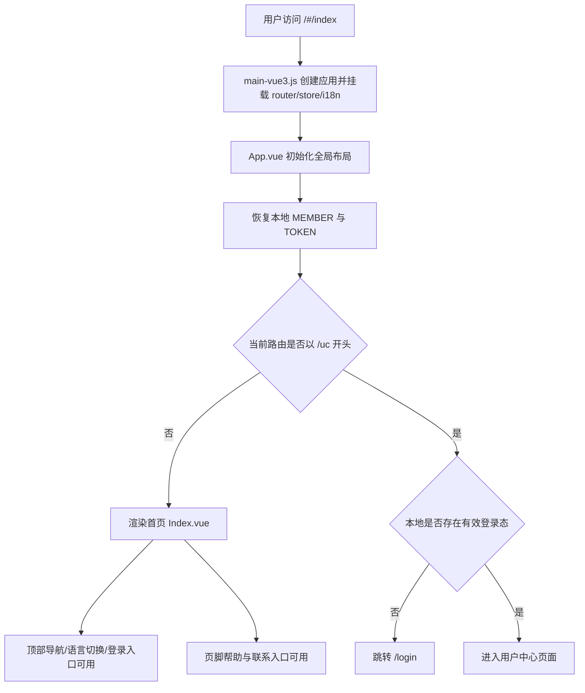
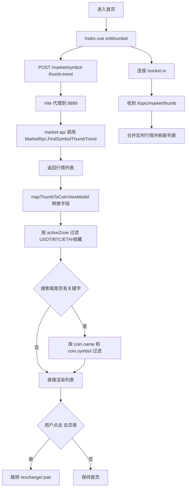
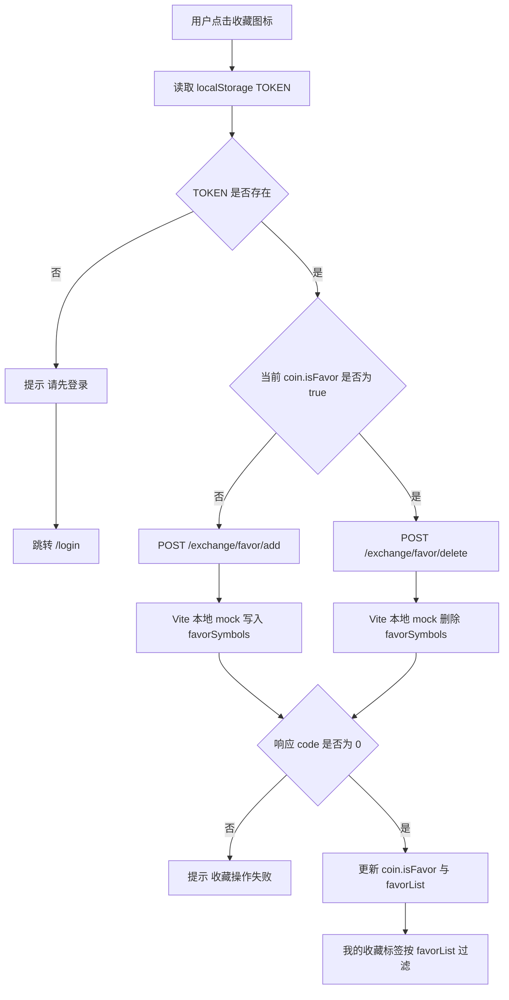
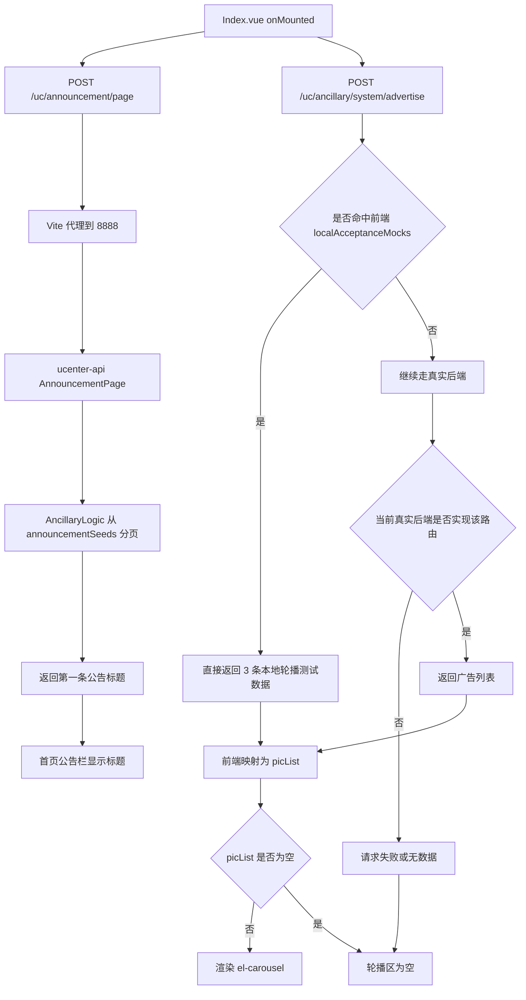

# 首页业务流程梳理

## 1. 首页进入与全局框架

### 用户操作步骤

1. 用户访问 `/#/index`，进入首页。
2. 用户可通过顶部导航进入币币交易、C2C、OTC、永续合约、秒合约、公益创新室、矿机、众筹等页面。
3. 未登录用户可从右上角进入登录/注册；已登录用户可进入用户中心、资产管理、交易管理等页面。
4. 用户可在页脚进入关于我们、平台公告、帮助中心、条款协议和联系方式相关页面。

### 业务逻辑说明

1. 前端入口从 `src/main-vue3.js` 启动 Vue 3 应用，挂载路由、Vuex 和 i18n。
2. 根组件 `src/App.vue` 负责首页顶部导航、语言切换、登录态展示、移动端抽屉导航、页脚信息和返回顶部。
3. 根组件初始化时会调用 `store.commit('recoveryMember')` 恢复本地登录态，并根据当前路由高亮导航。
4. 首页主体内容通过 `router-view` 加载 `src/pages-vue3/index/Index.vue`。
5. `/uc` 开头的用户中心路由受前置守卫保护，未登录会跳转到 `/login`，首页本身不受登录拦截。

### 流程图

## 2. 行情浏览、搜索与分区筛选

### 用户操作步骤

1. 用户进入首页后，默认看到行情表格。
2. 用户可切换 `USDT 区`、`BTC 区`、`ETH 区`、`我的收藏` 四个标签。
3. 用户可在搜索框输入币种简称或交易对关键字筛选列表。
4. 用户可点击某一行的“去交易”进入对应交易对页面。

### 业务逻辑说明

1. `Index.vue` 挂载后按顺序调用 `loadFavorList`、`loadCoinList`、`loadAds`、`loadAnnouncement`，然后建立 Socket 连接。
2. `loadCoinList` 请求 `api.market.thumbTrend`，即 `/market/symbol-thumb-trend`。
3. Vite 将 `/market` 代理到 `market-api:8889`，`market-api` 的 `SymbolThumbTrend` 再调用 `MarketRpc.FindSymbolThumbTrend` 获取行情快照。
4. 前端用 `src/pages-vue3/index/market.js` 的 `mapThumbToCoinViewModel` 将返回数据转换成首页表格需要的结构，补齐 `name`、`base`、`href`、`rise`、`change24h`、`isFavor` 等字段。
5. `activeZone` 控制基础计价区过滤，`searchText` 再对当前分区结果做二次筛选。
6. 点击“去交易”后，前端跳转到 `/exchange/${coin.href}`，例如 `BTC/USDT` 会跳到 `/#/exchange/btc_usdt`。
7. 页面还会通过 `/socket.io` 连接到 `market-api`，监听 `/topic/market/thumb`，把推送数据并入现有列表，实时刷新价格。

### 流程图

## 3. 收藏功能

### 用户操作步骤

1. 用户在 `USDT`、`BTC`、`ETH` 分区内点击某个币种左侧收藏图标。
2. 未登录时，页面提示先登录并跳转登录页。
3. 已登录时，点击后显示收藏成功或取消收藏成功。
4. 用户切换到“我的收藏”标签，可只查看已收藏的交易对。

### 业务逻辑说明

1. 首页收藏按钮调用 `toggleFavor`。
2. `toggleFavor` 先读取本地 `TOKEN`，没有 token 时直接 `ElMessage.warning('请先登录')` 并跳转 `/login`。
3. 有 token 时，前端按当前状态调用 `/exchange/favor/add` 或 `/exchange/favor/delete`，并带上 `x-auth-token` 请求头。
4. 当前仓库里 `exchange-api` 并没有注册 `favor/add`、`favor/delete`、`favor/find` 路由，真实后端实现缺失。
5. 当前本地开发环境通过 `mscoin-frontend/dev/localAcceptanceMocks.mjs` 兜底：
   - `POST /exchange/favor/find` 返回当前 mock 内存中的收藏列表。
   - `POST /exchange/favor/add` 把 `symbol` 加入内存集合并返回成功。
   - `POST /exchange/favor/delete` 从内存集合删除 `symbol` 并返回成功。
6. 前端收到成功响应后，会同步更新当前行的 `coin.isFavor` 和 `favorList`，因此“我的收藏”标签会立即生效。
7. 该收藏状态目前只保存在前端 Vite 进程内存里，重启前端开发服务后会恢复为空，不会落真实后端。

### 流程图

## 4. 公告与广告轮播

### 用户操作步骤

1. 用户进入首页后，先看到顶部公告栏。
2. 页面中部会显示广告轮播区域。
3. 当前本地联调环境下，轮播会展示预置的三张测试图片。

### 业务逻辑说明

1. `loadAnnouncement` 请求 `/uc/announcement/page`，参数是 `pageNo=1`、`pageSize=1`、`lang=CN`。
2. Vite 将 `/uc` 代理到 `ucenter-api:8888`，`ucenter-api` 的 `AnnouncementPage` 调用 `AncillaryLogic.AnnouncementPage`。
3. `AncillaryLogic` 不查数据库，而是直接从本地 `announcementSeeds` 中切分页数据，首页只取第一条标题显示在公告栏。
4. `loadAds` 请求 `/uc/ancillary/system/advertise`，首页按 `sysAdvertiseLocation=1` 和 `lang=CN` 请求轮播数据。
5. 当前 `ucenter-api` 并没有注册 `/uc/ancillary/system/advertise` 路由。
6. 当前本地联调环境下，该接口会被 `localAcceptanceMocks.mjs` 先拦截，直接返回三条测试广告数据：
   - `BTC/USDT 交易入口`
   - `众筹与公益创新实验室`
   - `矿机专区体验页`
7. 前端把返回数据映射成 `picList`，再用 `el-carousel` 渲染轮播图；如果返回空数组，则轮播区不显示内容。

### 流程图

